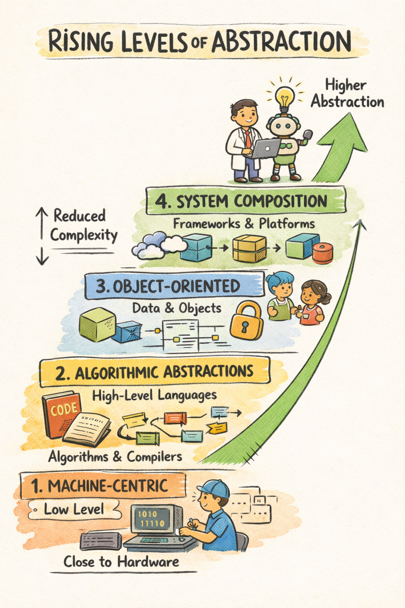

# Software as a Story of Rising Abstraction

The history of software engineering can be understood as a sequence of **abstraction shifts**. Each time complexity overwhelms existing techniques, the field does not simply push harder at the same level. Instead, it **raises the level of abstraction**, reducing the **cognitive distance** between human intention and executable systems. The so-called golden ages of software engineering are the periods when such abstraction shifts fundamentally reshape what engineers can build and how they think.

This topic was discussed in the Podcast [Software Engineering Past, Present, and Future with Grady Booch
](https://podcasts.apple.com/ch/podcast/software-engineering-past-present-and-future-with/id1625932222?i=1000748671715).

{.center width="80.0%"}

<!-- more -->

# The Golden Ages of Software Engineering

## Era I: The Machine-Centric Period

_Programming Close to Hardware_

In the earliest period, software was tightly bound to hardware. Programming meant speaking the machine’s language directly. Compute was scarce and expensive, and the dominant constraint was the machine itself. Human effort was optimized around hardware limitations.

This era made a core tension visible: expressing ideas at the machine level imposed enormous **cognitive load**. The friction between human thought and machine execution was high. The stage was set for the first major abstraction leap.

## Golden Age I: Algorithmic Abstractions

_The Rise of High-Level Languages and Compilers_

The first golden age begins with the rise of **high-level programming languages** and **compilers**. The abstraction shift is profound: instead of describing instructions in machine code, engineers describe **algorithms** in human-oriented languages, and compilers bridge the gap.

The dominant unit of thought becomes the **algorithm**. Software is largely about mathematical procedures and formal computation. By lifting developers above assembly and machine code, compilers dramatically increase productivity and reliability. This is a golden age because it transforms software from a hardware-bound craft into a scalable intellectual discipline.

Importantly, fears at the time that higher-level languages would eliminate programmers proved misguided. Instead, they enabled **more software to be written**, not less.

## Golden Age II: Managing Complexity

_Objects, Information Hiding, and Models_

As systems grew larger, distributed, real-time, and long-lived, algorithmic abstraction was no longer sufficient. The problem shifted from “how to compute” to **“how to manage interacting parts over time.”**

The abstraction focus moved from pure procedures to structured entities: **data and behavior treated as a cohesive unit**. Concepts such as **information hiding**, **abstract data types**, and **object-oriented design** provided new tools for managing complexity. Engineers began reasoning about systems not just through code, but through **higher-level models**.

This era is a golden age because it introduced systematic ways to contain complexity. By defining boundaries and responsibilities, it allowed teams to reason about large systems without understanding every detail at once. At the same time, it demonstrated a recurring lesson: **every powerful abstraction can be overused**. Mechanisms like deep inheritance hierarchies sometimes increased complexity rather than reducing it. The core insight, however, endured: **structure and boundaries matter**.

## Golden Age III: System Composition

_Frameworks, Platforms, and Integration_

The next shift moves beyond individual classes and modules. Software engineering increasingly becomes the art of composing systems from **packages, frameworks, services, and platforms**.

Instead of building everything from scratch, engineers assemble capabilities: messaging systems, storage layers, UI frameworks, observability stacks, deployment pipelines. The dominant task becomes **orchestration and integration** rather than low-level construction.

This era qualifies as a golden age because it again raises the unit of construction. The abstraction level moves from “how to structure code” to **“how to combine system-level capabilities.”** As a result, entire categories of applications become economically feasible that were previously too costly or complex.

# The Current Inflection

## AI-Assisted Development as an Abstraction Shift

AI-assisted programming fits naturally into this historical pattern. Rather than representing a rupture with the past, it continues the trajectory of **raising abstraction and reducing friction**.

Just as compilers did not eliminate programmers, and frameworks did not eliminate engineers, AI tools shift the focus upward. More software becomes **economically viable to build**. Prototypes, tooling, and one-off solutions that once seemed too expensive to justify now become feasible.

However, the nature of **engineering judgment** becomes even more central. Tools can accelerate production, but they do not replace the need for **discernment, architectural clarity, and responsibility**, especially in durable systems.

# Structural Forces Behind the Eras

## Economics and Engineering Practice

Economic forces have always shaped software engineering practices. When machines were expensive and scarce, processes were optimized to minimize machine waste. As hardware became cheap and abundant, **human attention and expertise became the scarce resource**.

This shift highlights an important distinction between **disposable software** and **durable software**. Disposable software is cheap to replace and carries limited long-term risk. Durable software is long-lived, safety-critical, or economically significant, and the **cost of change is high**. Different levels of rigor are appropriate for each, but both require sound abstraction and engineering discipline.

# Enduring Principles

Despite changing tools and paradigms, certain principles remain constant.

Engineering is about **balancing forces**: technical, economic, social, and legal. Architecture consists of **significant design decisions**, where significance is defined by the **cost of change**. Good abstractions are **cohesive, loosely coupled, and as simple as possible** without being simplistic.

New tools should be treated as **amplifiers, not authorities**. They expand what is possible, but they do not remove the need for experience, critical thinking, and ethical responsibility.

# Conclusion

Each golden age expands human capability. Each abstraction shift reduces friction and increases creative reach. But with greater capability comes greater responsibility. Software reshapes economies, institutions, and power structures.

The lesson of these eras is not that engineers become obsolete. It is that they move upward, closer to intention, judgment, and impact. The best days of software engineering are not defined by the disappearance of complexity, but by our evolving ability to manage it wisely.
