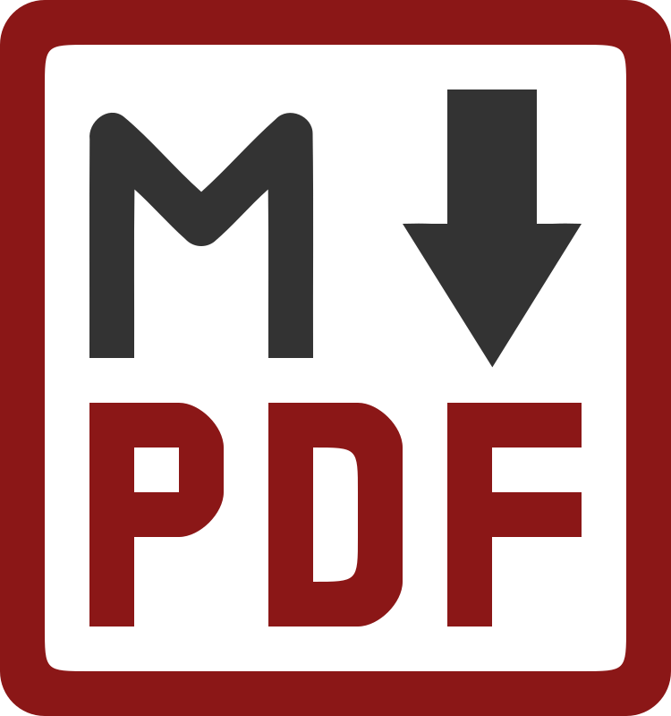
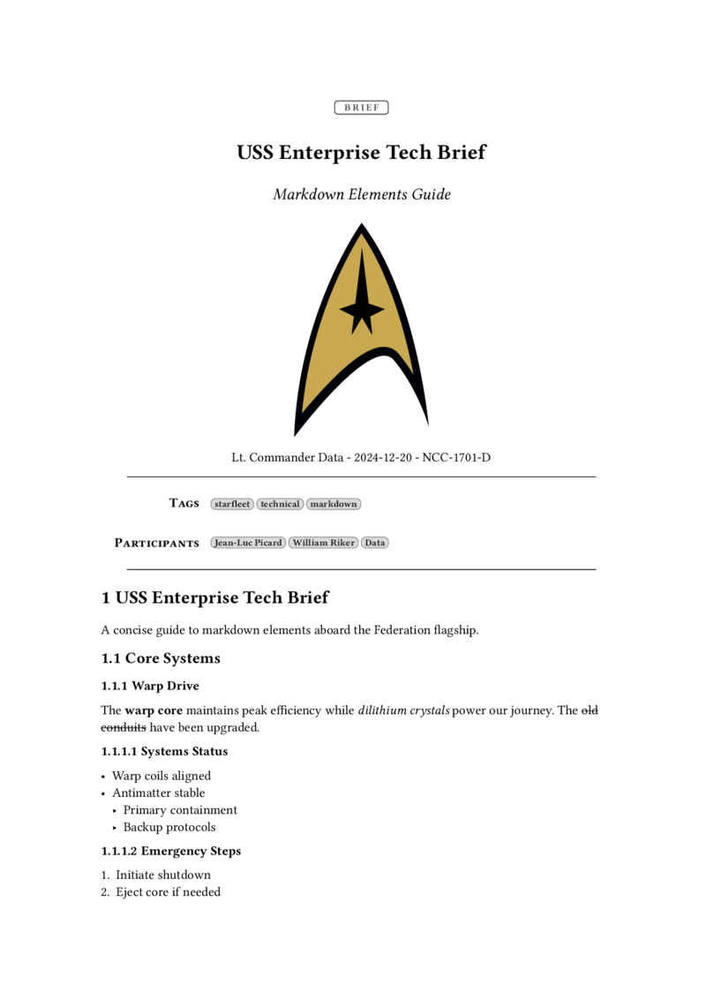
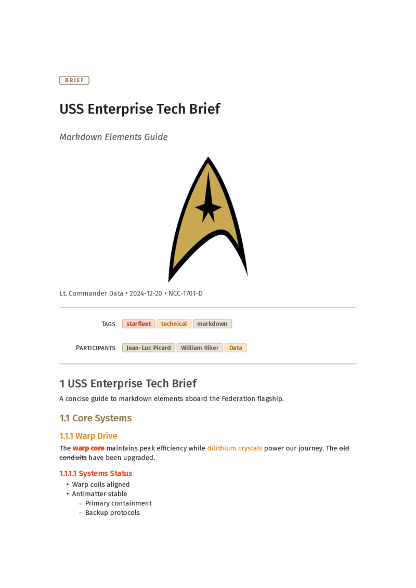
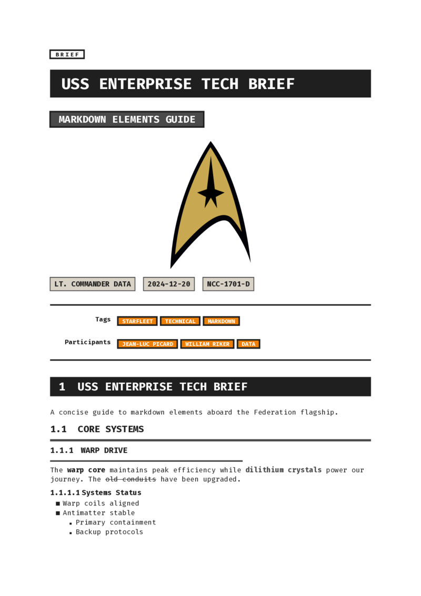
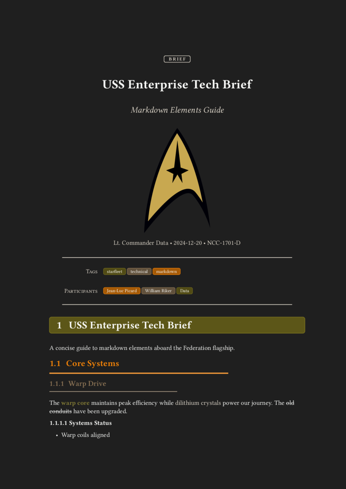

# My Notes Became a Standard

For many years my "personal knowledge base" was a folder full of `.txt` files. Then it became a folder full of `.md` files. Then those files grew a little YAML hat on top. And a few months ago Google published a spec for AI agents that looks... a lot like that little YAML hat.

This post is about that journey, about what Google's **Open Knowledge Format (OKF)** actually is, and about [**md-pdf 0.2.0**](https://crates.io/crates/md-pdf), which now speaks OKF natively. It takes files that were written for machines and turns them back into something a human wants to read: a nicely typeset PDF, thanks to [Typst](https://typst.app).

{.center width="30.0%"}

<!-- more -->

**In this post:**

1. [Act 1: the folder of text files](#act-1-the-folder-of-text-files)
2. [Act 2: Markdown](#act-2-markdown)
3. [Act 3: the little YAML hat](#act-3-the-little-yaml-hat)
4. [Act 4: wait, Google did what?](#act-4-wait-google-did-what)
5. [So what *is* OKF, really?](#so-what-is-okf-really)
6. [The problem: frontmatter is for machines](#the-problem-frontmatter-is-for-machines)
7. [md-pdf 0.2.0: OKF in, beautiful PDF out](#md-pdf-020-okf-in-beautiful-pdf-out)
8. [What I learned from all this](#what-i-learned-from-all-this)

## Act 1: the folder of text files

My knowledge base started the way I think most engineers' do: a bunch of plain text files. Notes about a tool I set up once and would definitely forget. A command I'd googled three times. Meeting notes. Snippets.

Plain text has some very nice properties:

- it opens everywhere, forever
- every command-line tool works on it: the classics like `grep`, `find` and `cat`, and their modern (Rust-powered) successors like [`ripgrep`](https://github.com/BurntSushi/ripgrep), [`fd`](https://github.com/sharkdp/fd) and [`bat`](https://github.com/sharkdp/bat)
- it survives every app that promised to be "the last note-taking app you'll ever need"

The catch: these files were only *semi-structured*. Every file had *some* structure, just never the *same* structure. Sometimes the first line was a title. Sometimes there was a date. Sometimes the date was at the bottom. Sometimes I was clearly very tired.

## Act 2: Markdown

At some point the `.txt` files became `.md` files. Honestly, that change was mostly cosmetic at first: I'd been writing pseudo-Markdown for years anyway (`*` for bullets, `#` for headings, backticks around commands). Renaming the files just made editors agree with me.

What Markdown gave me:

- headings I could fold and navigate
- code blocks with syntax highlighting
- links between notes

What it did **not** give me: a way to answer questions like *"show me all my notes about FPGAs that are still drafts"* or *"what did I write in 2019 about Rust?"*.

## Act 3: the little YAML hat

A couple of years ago I started adding **frontmatter** to every note. If you haven't seen it: frontmatter is a YAML block between two `---` lines at the very top of a Markdown file. Static site generators (including the one powering this blog) have used it forever.

A note of mine looked roughly like this:

```yaml
---
title: "Setting up a Yocto build server"
subtitle: "Notes from the third time I did this"
author: "tschinz"
date: 2024-03-12
version: "0.3"
status: draft
lang: en
keywords: [yocto, linux, embedded, build]
---

# Setting up a Yocto build server

...
```

This was a small change with a surprisingly big payoff. Suddenly:

- searching by `keywords` was trivial
- `status: draft` let me find the half-finished stuff
- `date` let me sort things chronologically without trusting file modification times (which, as we all know, lie)

And, crucially for the rest of this story, it's the exact format [md-pdf](https://github.com/tschinz/md-pdf) was built around. I wrote md-pdf because I wanted to hand one of those notes to a colleague *as a PDF*, without opening LaTeX, Word, or a browser print dialog. The frontmatter becomes the title page: title, subtitle, author, date, version, table of contents. The body gets typeset by Typst.

## Act 4: wait, Google did what?

In June 2026 Google Cloud published the [**Open Knowledge Format (OKF)**](https://github.com/GoogleCloudPlatform/knowledge-catalog/blob/main/okf/SPEC.md), with a v0.2 following in July. The pitch: a vendor-neutral way to give AI agents curated context.

I opened the spec expecting something complicated. Protobufs, maybe. A JSON-LD schema. A new file extension.

Here is (roughly) what I found instead:

> A directory of Markdown files, each with YAML frontmatter, linked together with normal Markdown links.

That's... my knowledge base. That's literally the folder on my laptop.

Let me put them side by side:

| My notes (for years)      | OKF                          | What it means                         |
| ------------------------- | ---------------------------- | ------------------------------------- |
| *(implicit, folder name)* | `type` **(required)**        | what kind of thing is this?           |
| `title`                   | `title`                      | human-readable name                   |
| `subtitle`                | `description`                | one-line summary                      |
| `date`                    | `timestamp` / `generated.at` | when was this written / changed       |
| `keywords`                | `tags`                       | cross-cutting categories              |
| `status: draft`           | `status: draft`              | lifecycle (`draft`, `stable`, `deprecated`) |
| `lang`                    | *(free-form extra key)*      | language                              |
| links between notes       | links between concepts       | the "graph" part                      |

This is **convergent evolution**: lots of people who keep notes in plain text end up in exactly the same place, because Markdown + YAML frontmatter is the simplest thing that works for both humans *and* tools. (I'm clearly not alone; there are already a bunch of "I already do this, and now it has a name" posts out there.)

But I'll admit there's a very specific feeling when a big company publishes a spec and your reaction is "oh, I should rename `subtitle` to `description`".

## So what *is* OKF, really?

Let me try to explain it the way I wish someone had explained it to me.

### The one rule

Every Markdown file in an OKF "bundle" must start with frontmatter, and that frontmatter must have a `type`. That's it. That's the only required field.

```yaml
---
type: Playbook
---
```

`type` is free text. There is no central registry. `BigQuery Table`, `Metric`, `Playbook`, `Recipe`, `Meeting Notes`: all valid. Consumers are told to tolerate types they've never seen before.

### The recommended fields

Then there's a small set of fields that are *recommended*:

- `title`: the human name
- `description`: one sentence
- `resource`: a URI pointing to the real thing this document describes (a table, a repo, a dashboard)
- `tags`: a YAML list

A realistic note in my knowledge base, OKF-style:

```yaml
---
type: Howto
title: "Setting up a Yocto build server"
description: "Notes from the third time I did this."
tags: [yocto, linux, embedded, build]
status: draft
timestamp: 2024-03-12
---

# Prerequisites

You need a machine with lots of disk. See [my sstate cache notes](/yocto/sstate-cache.md).
```

Notice the link starts with `/`. In OKF that means "relative to the root of the bundle", which keeps links stable when you move files around.

### The "who wrote this and can I trust it?" fields (v0.2)

This is the part that is genuinely new for me, and the part that makes it obvious the format was designed with **agents** in mind. In a world where an LLM might have written half your docs, you want to know:

- **who** produced this?
- **did a human check it?**
- **what is it based on?**
- **is it stale?**

OKF v0.2 adds optional fields for exactly that:

```yaml
---
type: Playbook
title: "Incident response: data freshness alert"
description: Steps to triage a freshness alert on the orders pipeline.
tags: [oncall, incident]
generated: { by: reference_agent/gemini-2.5-pro, at: 2026-06-20T22:53:05Z }
verified: { by: human:ahormati, at: 2026-06-25T09:00:00Z }
stale_after: 2026-12-31T00:00:00Z
sources:
  - id: runbook-v1
    resource: https://wiki.example/oncall/orders
    title: Original on-call runbook
---
```

A few things I like here:

- **Actors have a tiny naming convention.** `human:<id>` for people, `<tool>/<version>` for agents, `process:<id>` for cron-job-style things. An agent can check "has a `human:` ever verified this?" with a string prefix match. Delightfully low-tech.
- **`stale_after`** is an absolute date after which the content should be treated with suspicion. I have *so many* notes that should have had this.
- **`sources`** can be referenced from the body with normal Markdown footnotes, so individual claims can point back to where they came from.

### Special files: `index.md` and `log.md`

A bundle can have two reserved filenames in any directory:

- `index.md`: a list of what's in this folder, grouped by headings, with a one-line description per entry. This is for **progressive disclosure**: an agent reads the index first and only opens the files it needs, instead of stuffing everything into its context window.
- `log.md`: a changelog, newest first, grouped by `YYYY-MM-DD` headings.

```markdown
# Embedded Linux

* [Yocto build server](yocto-build-server.md) - how I set up the shared build box
* [sstate cache](sstate-cache.md) - sharing build artifacts between machines
```

Again: this is just a README with bullet points. It's the kind of thing people have been writing by hand forever. The spec just says "please write it like *this*, so a machine can rely on it".

### Why this is a good idea

I think the core insight of OKF is kind of beautiful: **the best format for AI agents turned out to be the best format for humans too.** No SDK, no runtime, no database. You can open an OKF bundle in `vim`, render it on GitHub, search it with `rg`, and put it in `git`. The agent-specific parts are just a few extra YAML keys that humans can happily ignore.

## The problem: frontmatter is for machines

Here's the thing though. Once you lean into OKF, your files start to look like this at the top:

```yaml
---
type: Attested Computation
title: Revenue for fiscal year
description: Recognized revenue for a fiscal year, per Finance's definition.
status: stable
generated: { by: reference_agent/gemini-2.5-pro, at: 2026-06-20T22:53:05Z }
verified: { by: human:ahormati, at: 2026-06-25T09:00:00Z }
stale_after: 2026-09-23T00:00:00Z
tags: [finance, revenue]
---
```

That's great for an agent. It is *not* great for your manager, who you just sent the file to, and who is now looking at a wall of YAML wondering what `human:ahormati` means.

Machine-readable and human-readable are not the same thing. And that's exactly the gap md-pdf is for.

## md-pdf 0.2.0: OKF in, beautiful PDF out

[md-pdf](https://github.com/tschinz/md-pdf) is a small Rust CLI that takes a Markdown file and produces a PDF via [Typst](https://typst.app). Typst is a modern typesetting system: think "LaTeX-quality output, but it compiles in milliseconds and the error messages are written for humans".

Version **0.2.0**, now on [crates.io](https://crates.io/crates/md-pdf), switches md-pdf's frontmatter to **OKF-canonical field names**. That was a breaking change (hence the version bump), but with a safety net: all my old field names still work as aliases.

| OKF name      | Old alias (still works) | Shows up in the PDF as               |
| ------------- | ----------------------- | ------------------------------------ |
| `type`        | -                       | a small document-type label          |
| `title`       | -                       | the big title                        |
| `description` | `subtitle`              | the subtitle                         |
| `timestamp`   | `date`                  | the date (full ISO 8601 is accepted) |
| `tags`        | `keywords`              | keywords                             |
| `language`    | `lang`                  | hyphenation and typography rules     |

And the important bit: **unknown keys are not rejected**. They're passed through to the Typst template. So an OKF document full of `generated`, `verified` and `sources` goes in without complaint, and a template can decide to show (or hide) them.

That means my decade-old notes and brand-new OKF files go through the exact same pipeline. I didn't have to migrate anything to get started. (I did migrate anyway, because I'm like that.)

### Trying it

You need Typst installed first:

```bash
brew install typst
cargo install md-pdf
```

Then take any OKF document:

```markdown
---
type: "brief"
title: "USS Enterprise Tech Brief"
description: "Markdown Elements Guide"
logo: "resources/starfleet.svg"
author: "Lt. Commander Data"
timestamp: "2024-12-20"
version: "NCC-1701-D"
language: "en"
toc: false
tags: ["starfleet", "technical", "markdown"]
participants: ["Jean-Luc Picard", "William Riker", "Data"]
template: "simple"
---

# USS Enterprise Tech Brief

A concise guide to markdown elements aboard the Federation flagship.
...
```

and run:

```bash
md-pdf starfleet.md --open
```

That's it. You get a typeset PDF with a proper title block (the `type` shows up as a label, `description` becomes the subtitle), headings, tables, code blocks with syntax highlighting, math (`$v = wf^3c$` just works, because Typst), and task lists.

{.center width="60.0%"}

See the tiny `BRIEF` badge above the title? That's the OKF `type` field. The YAML block that was aimed at machines turned into a title page for humans: `description` became the subtitle, `author`, `timestamp` and `version` form the byline, and `tags` (plus any extra key like `participants`) are shown as little chips.

A few other things I use all the time:

```bash
# live preview: rebuild the PDF every time I save
md-pdf --watch note.md --open

# pick a different look
md-pdf note.md -t brutalist

# check that all the links in the note still resolve
md-pdf --check-links note.md
```

`--check-links` turns out to be a surprisingly good companion to OKF's `sources` and `resource` fields: an agent is told to tolerate broken links, but *I'd* like to know about them.

### Pick a template

md-pdf ships with five templates, and you can drop your own `.typ` files into its config directory:

- **none**: minimal, just the content
- **simple**: clean and professional, with headers and footers
- **playful**: colorful, loosely inspired by Dieter Rams
- **brutalist**: high contrast, bold, unapologetic
- **darko**: a dark theme, for people who read PDFs at 2 a.m.

Here's the exact same Markdown file in `simple`, `playful`, `brutalist` and `darko`:

{width="24.0%"} {width="24.0%"} {width="24.0%"} {width="24.0%"}

Same content, same frontmatter, four very different moods. The full PDFs are in the [examples folder](https://github.com/tschinz/md-pdf/tree/main/examples) of the repo.

You can set the template per file (`template: "playful"` in the frontmatter), per invocation (`-t playful`), or globally in `~/.config/md-pdf/config.ron`, together with a default author and language so you never have to type your own name again.

## What I learned from all this

A few things I keep coming back to:

1. **Boring formats win.** Text files outlived every note-taking app I tried. Markdown + YAML is now apparently good enough for AI agents at Google scale. The most future-proof thing I did for my knowledge base was *not* choose anything fancy.
2. **Structure pays off slowly, then all at once.** Adding frontmatter felt like busywork for a while. Then one day search, filtering, PDF generation and now agent-compatibility all came for free.
3. **Machine-readable ≠ human-readable, and you need both.** OKF optimizes for agents. That's fine, as long as there's a cheap way to turn the same file back into something nice for humans. For me that's md-pdf and Typst.
4. **Write down who wrote it and whether it's still true.** I didn't need OKF v0.2 to tell me this, but I needed *something* to tell me. `stale_after` is going into a lot of my notes.

If you've also got a folder full of Markdown notes (I suspect you do), give it a try:

```bash
cargo install md-pdf
```

Add a `type:` to one of your notes, run `md-pdf` on it, and congratulations: you're now OKF-compliant *and* you have a pretty PDF. 🎉

## Links

- md-pdf on GitHub: [tschinz/md-pdf](https://github.com/tschinz/md-pdf)
- md-pdf on crates.io: [crates.io/crates/md-pdf](https://crates.io/crates/md-pdf)
- OKF specification: [GoogleCloudPlatform/knowledge-catalog/okf/SPEC.md](https://github.com/GoogleCloudPlatform/knowledge-catalog/blob/main/okf/SPEC.md)
- Google Cloud announcement: [How the Open Knowledge Format can improve data sharing](https://cloud.google.com/blog/products/data-analytics/how-the-open-knowledge-format-can-improve-data-sharing)
- Typst: [typst.app](https://typst.app)
