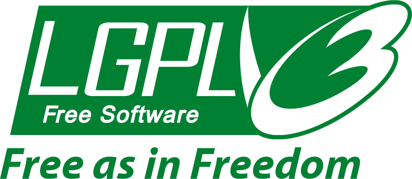
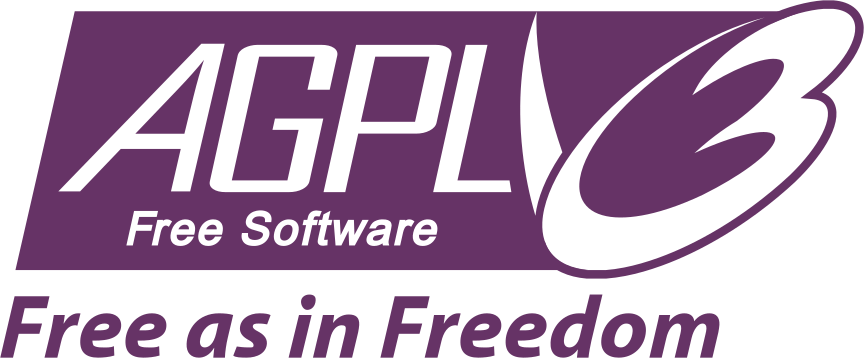

---
tags:
  - coding
  - licenses
---

# Licenses

{.center width="150px"}

## Contents

{nav}

## Overview

| Logo | Abbrev. | License | Ecosystem | Category | Commercial Use | Proprietary Use Allowed | Must Share Modifications | Modifications Allowed | Attribution Required | Notes |
|:---:|---|---|---|---|---|---|---|---|---|---|
|  | GLWTS | Good Luck With That Public License | Software | Public Domain | Yes | Yes | No | Yes | No | Extreme “no support/no warranty” attitude |
|  | WTFPL | Do What The Fuck You Want To Public License | Software | Public Domain | Yes | Yes | No | Yes | No | “Do anything” philosophy |
|  | CC0 | Creative Commons Zero | Content | Public Domain | Yes | Yes | No | Yes | No | Public-domain style |
|  | MIT | MIT License | Software | Permissive | Yes | Yes | No | Yes | Yes | Most common simple OSS license |
|  | BSD-3 | BSD 3-Clause License | Software | Permissive | Yes | Yes | No | Yes | Yes | Adds non-endorsement clause |
|  | CC BY | Creative Commons Attribution | Content | Permissive | Yes | Yes | No | Yes | Yes | Attribution only |
| {width="50px"} | Apache-2.0 | Apache License 2.0 | Software | Permissive | Yes | Yes | No | Yes | Yes | Includes patent protection |
|  | MPL-2.0 | Mozilla Public License 2.0 | Software | Weak Copyleft | Yes | Yes | Modified files only | Yes | Yes | File-level copyleft |
|  | LGPL | GNU Lesser General Public License | Software | Weak Copyleft | Yes | Yes (via linking) | Library only | Yes | Yes | Common for libraries |
|  | CC BY-SA | Creative Commons Attribution-ShareAlike | Content | Strong Copyleft | Yes | Limited | Yes | Yes | Yes | Wikipedia-style license |
|  | GPLv3 | GNU General Public License v3 | Software | Strong Copyleft | Yes | No | Entire derivative work | Yes | Yes | Strong reciprocity |
|  | AGPL | GNU Affero General Public License | Software | Strong Copyleft | Yes | No | Also for SaaS/network use | Yes | Yes | Extends GPL to web services |
|  | CC BY-NC | Creative Commons Attribution-NonCommercial | Content | Restricted | No | Limited | No | Yes | Yes | Non-commercial only |
|  | CC BY-ND | Creative Commons Attribution-NoDerivatives | Content | Restricted | Yes | Yes | Not applicable | No | Yes | Redistribution only |
|  | CC BY-NC-ND | Creative Commons Attribution-NonCommercial-NoDerivatives | Content | Highly Restricted | No | Limited | No | No | Yes | No commercial use and no modifications |
|  | CC BY-NC-SA | Creative Commons Attribution-NonCommercial-ShareAlike | Content | Restricted Copyleft | No | Limited | Yes | Yes | Yes | Non-commercial + derivatives must use same license |
