---
tags:
  - hardware
  - hw
  - 3d-printing
  - filling
---

# Structure Filling Patterns (Sparse infill patterns)

Sparse infill is the internal structure of a 3D print that balances strength, weight, flexibility, and print time. The Bambu Lab P1S (with Bambu Studio) supports a wide variety of **infill patterns**, each optimized for different needs.

## Summary
| Image                                                               | Pattern                 | Advantages                        | Disadvantages                 | Common Use Cases                   |
|---------------------------------------------------------------------|-------------------------|-----------------------------------|-------------------------------|------------------------------------|
| 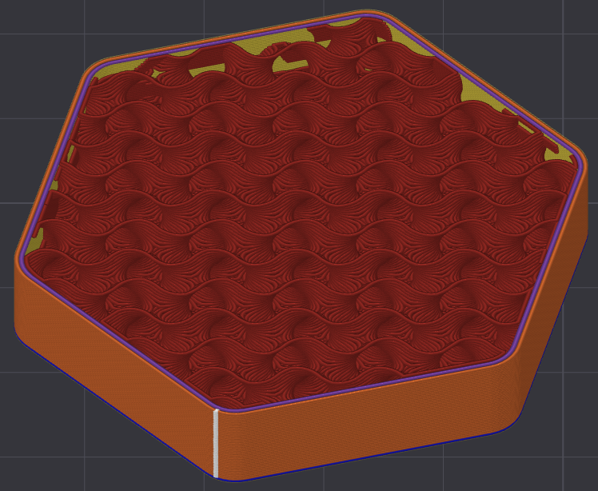                           | **Gyroid**              | Isotropic, efficient, fast        | Slightly less rigid than grid | General-purpose, flexible parts    |
| 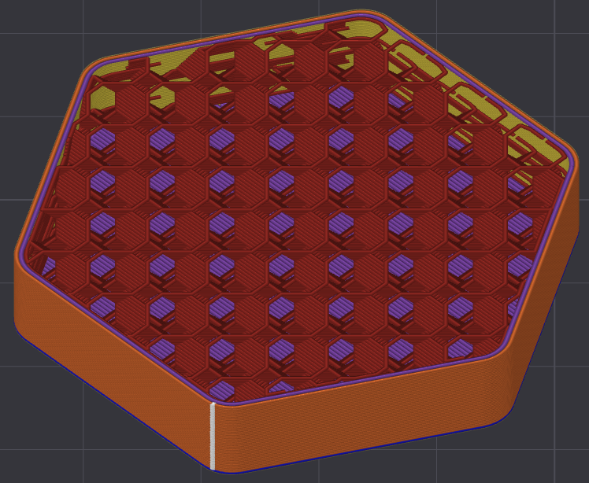               | **3D Honeycomb**        | Very strong in X/Y/Z, aesthetic   | Slower, more material         | Strong functional parts            |
| 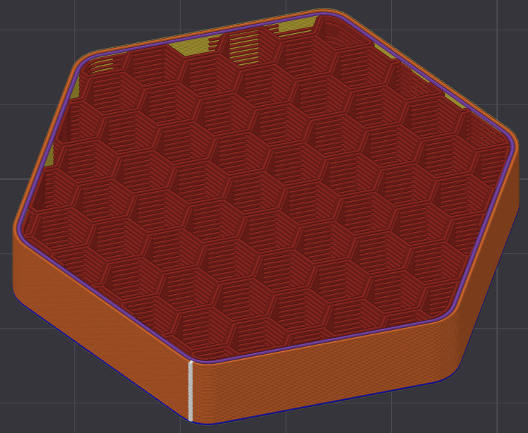                     | **Honeycomb**           | Very rigid, classic               | High material usage           | Functional parts needing stiffness |
| 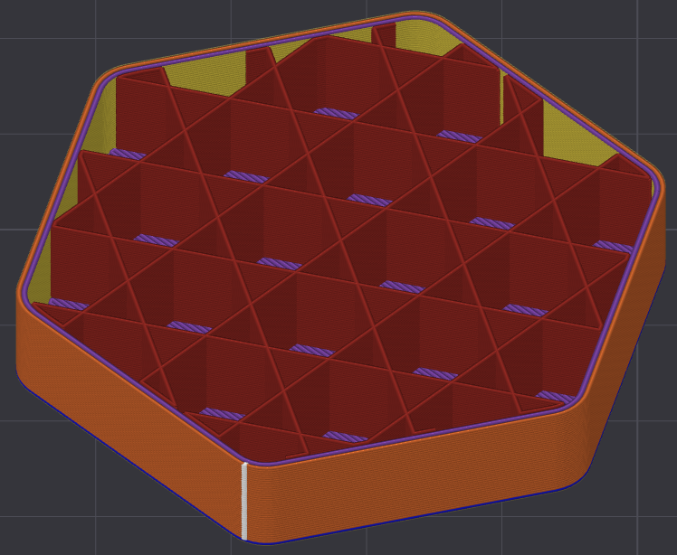                 | **Tri-Hexagon**         | One of the strongest patterns     | Slower, high material use     | Functional load-bearing parts      |
| 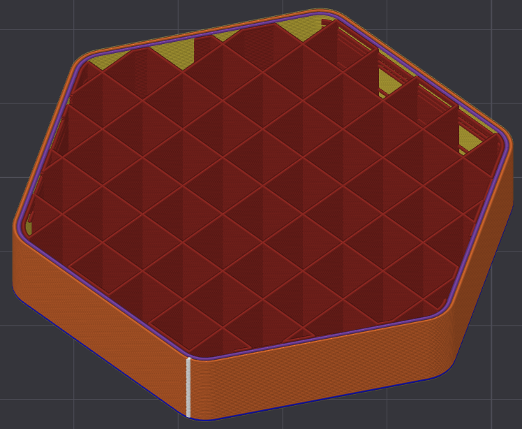                               | **Grid**                | Fast, simple, rigid in XY         | Less strength in Z            | Default for prototypes             |
| 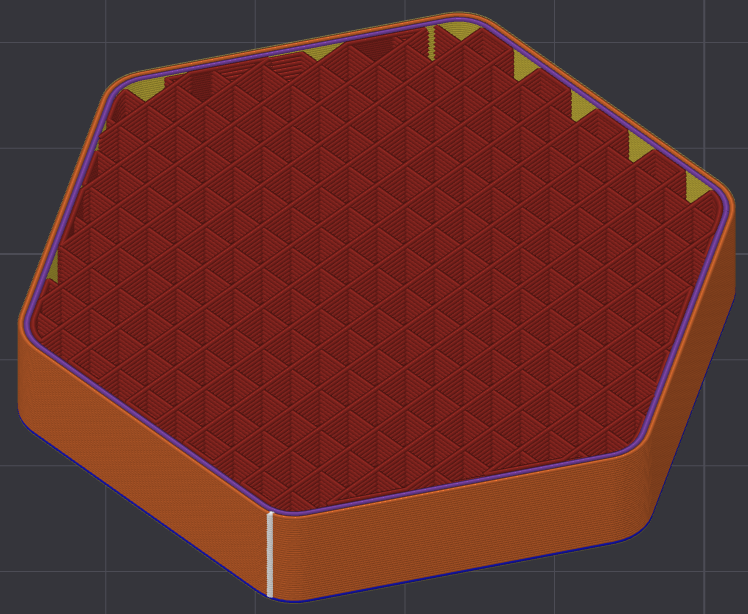                 | **Rectilinear**         | Fast, predictable                 | Weaker diagonally             | General prints, prototypes         |
| 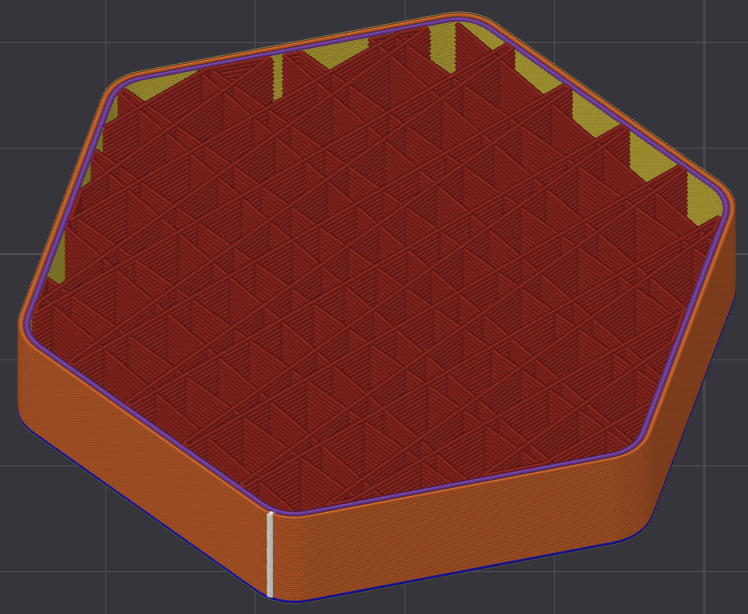                               | **Line**                | Fastest, minimal filament         | Weak in Z, anisotropic        | Drafts, quick prints               |
| 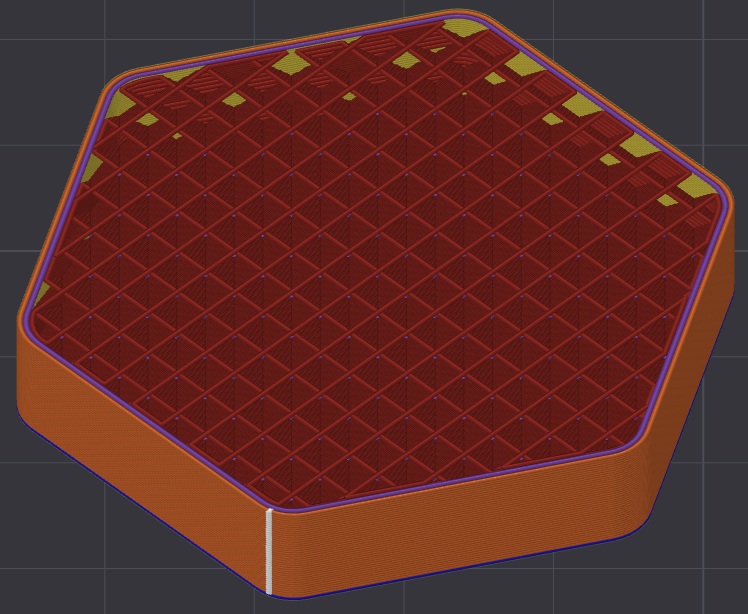                     | **Cross Zag**           | Balanced strength, easy removal   | Slightly slower               | General-purpose prints             |
| 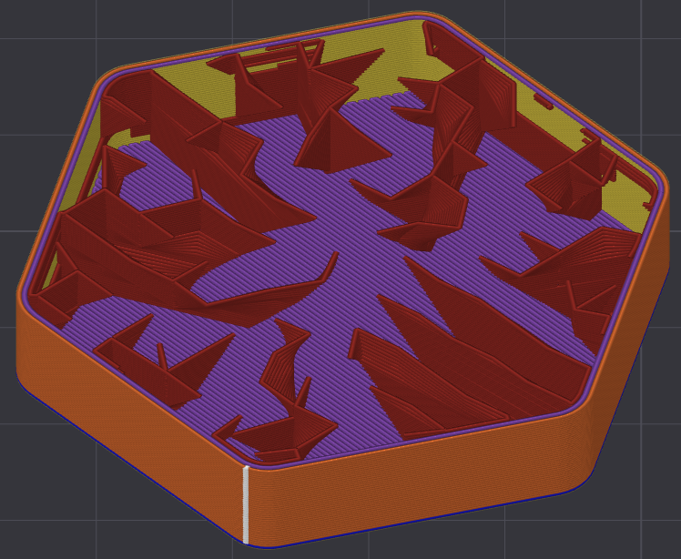                      | **Lighting**            | Very low material use for support | For support only              | Support structures                 |
| 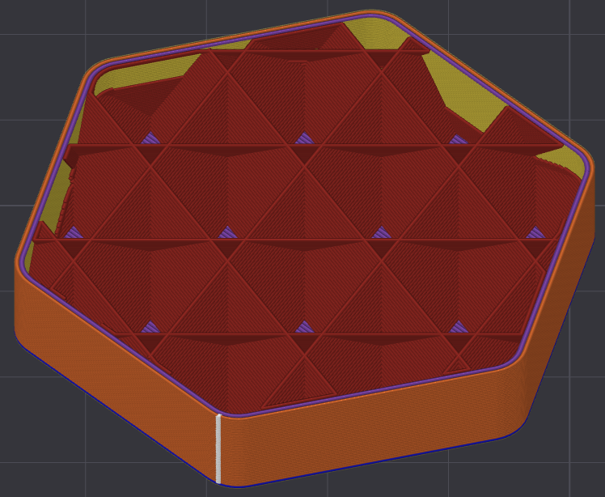           | **Adaptive Cubic**      | Variable density, efficient       | May create uneven strength    | Large parts, optimized infill      |
| 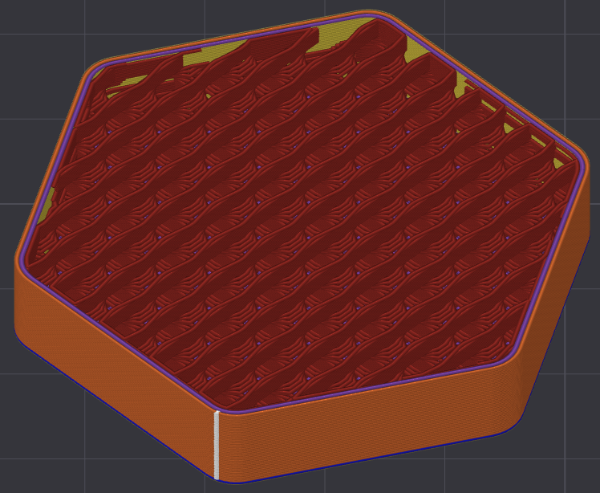                   | **Crosshatch**          | Strong, rigid                     | Harder to remove              | Structural parts, supports         |
| 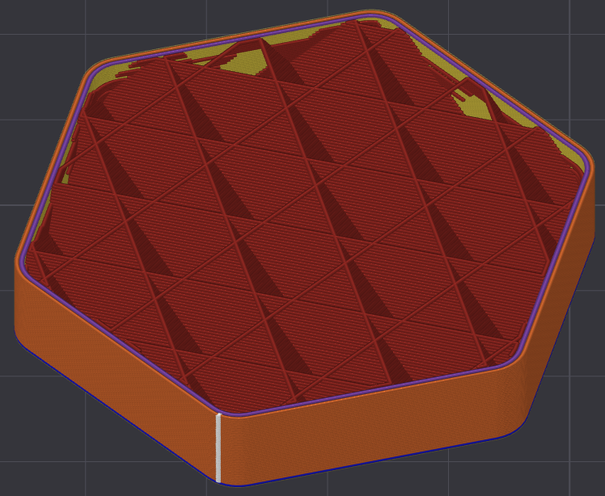                             | **Cubic**               | Isotropic strength                | Slightly more complex         | Mechanical parts                   |
| 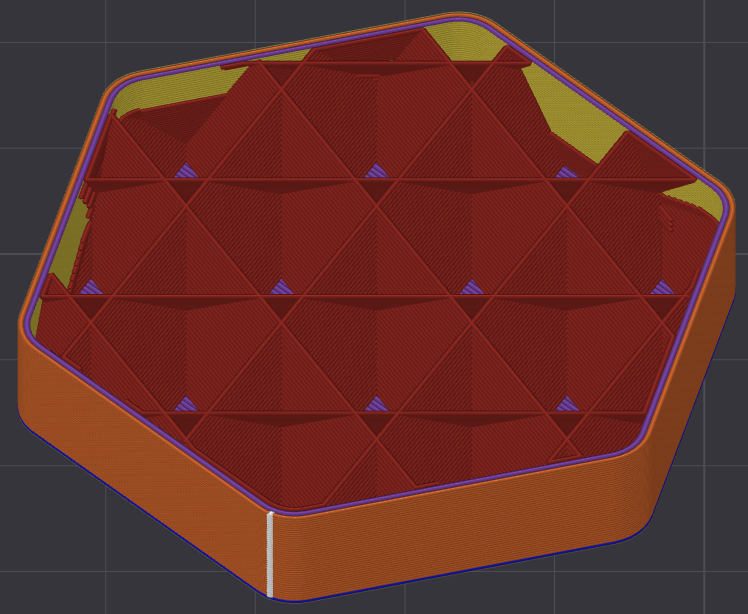             | **Support Cubic**       | Minimal support material          | For support only              | Support structures                 |
| 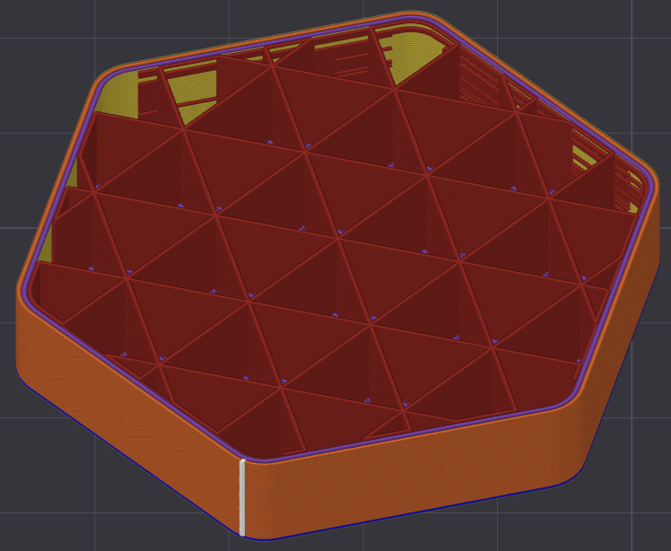                     | **Triangles**           | Very rigid in-plane               | Brittle under shear           | Brackets, flat parts               |
| 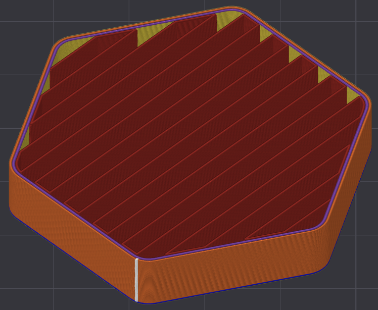 | **Aligned Rectilinear** | Easy print, consistent direction  | Weaker in cross axis          | Simple geometries                  |
| 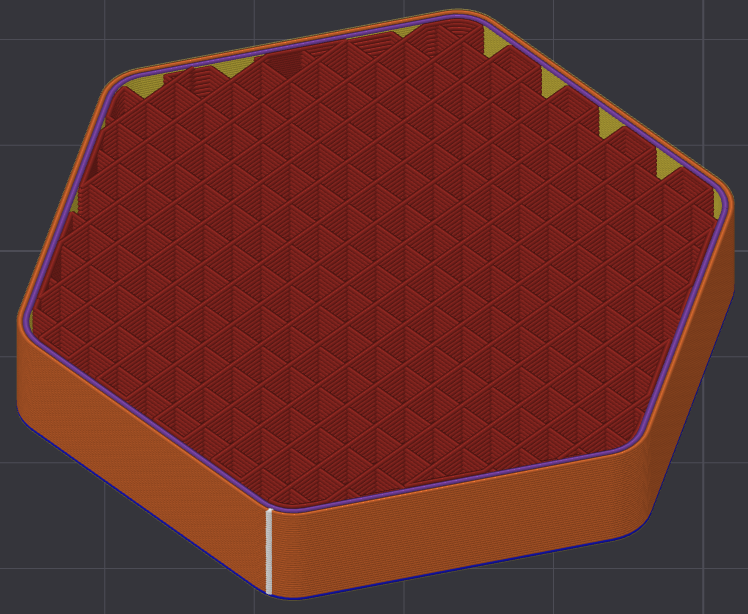                          | **Zigzig**              | Fast, similar to line             | Weak, decorative              | Drafts, aesthetic lines            |
| 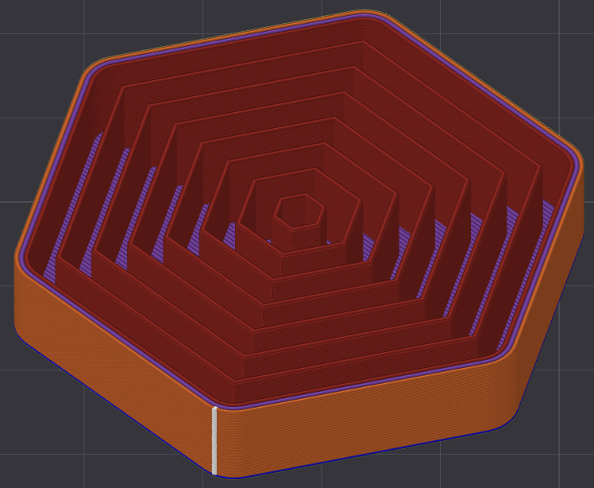                   | **Concentric**          | Good flexibility, follows shape   | Weak structural strength      | TPU/flexible prints                |
| 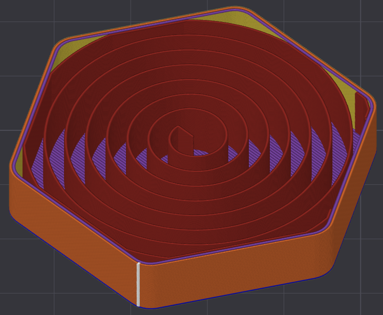       | **Archimedes Chord**    | Aesthetic spiral                  | Not optimized for strength    | Decorative objects                 |
| 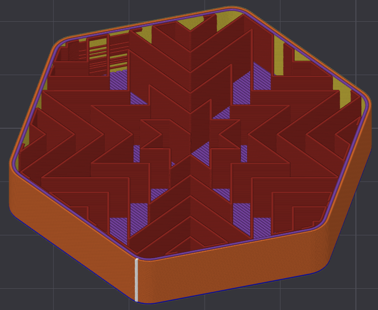       | **Octagram Spiral**     | Decorative, aesthetic             | Not structural                | Art, vases                         |
| 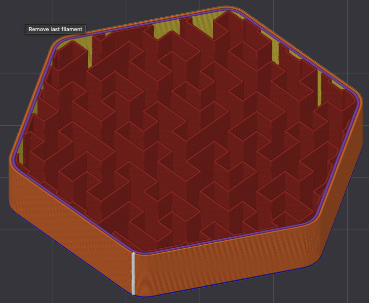             | **Hilbert Curve**       | Continuous line, aesthetic        | Not strong, slow              | Art pieces, visual infill          |

## Sparse Infill Percentages

The **infill percentage** sets how dense the internal structure is, balancing strength, weight, print time, and flexibility.

**Typical guidelines:**

| Infill %             | Usage                                           |
|----------------------|-------------------------------------------------|
| **0–5%**             | Hollow parts, vases, pure decoration             |
| **~15%** *(default)* | Good balance for most prints, prototypes, enclosures |
| **20–40%**           | Functional parts, added rigidity                 |
| **50%**              | Rarely needed — for very strong or load-bearing parts |
| **100%**             | Maximum strength, solid parts (threads, inserts, machining) |

**Notes:**

- **15% is a great default** — works for ~80% of prints.
- **More than 50%** is **rarely necessary** — increases weight & time significantly.
- **100%** only for parts needing **maximum rigidity**, **post-processing (tapping threads)**, or **machining**.
- **Gyroid / Cubic** patterns are especially efficient at 15–25%.
