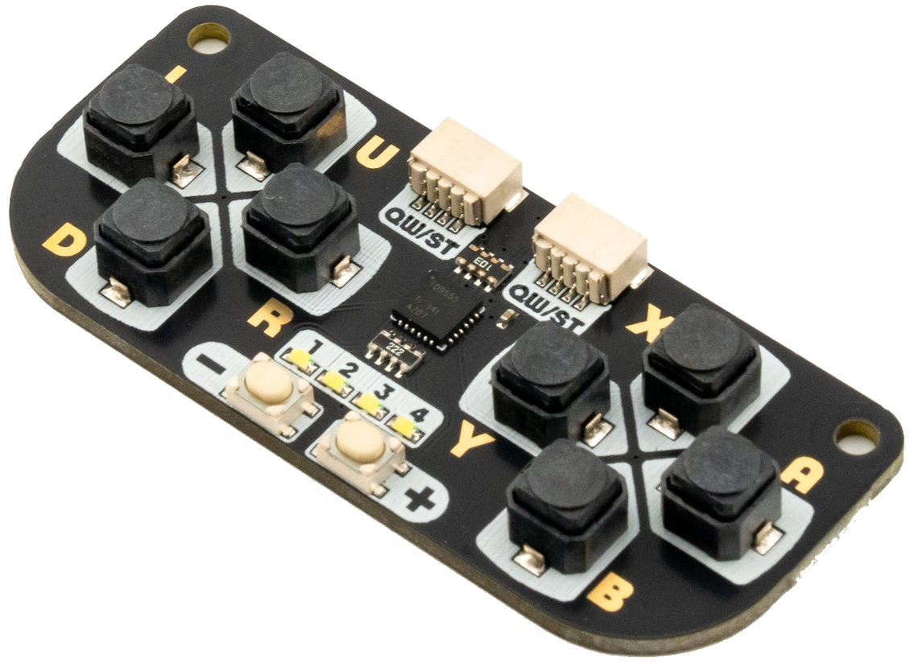
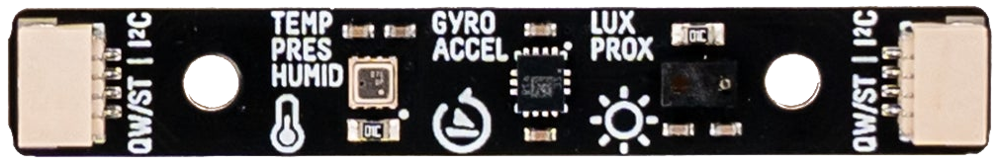

---
tags:
  - hardware
  - board
  - badgerware
  - accessory
---
# Accessories

## Qw/ST Pad

{.center width="50.0%"}

## Overview

The **Qw/ST Pad** is a compact, chainable I2C gamepad by [Pimoroni](https://shop.pimoroni.com/products/qwst-pad).

Each Qw/ST Pad has **eight big buttons** for inputs (plus **two smaller buttons** for settings adjustments) and **four user controllable white LEDs**.

Up to **4 Qw/ST Pads** can be connected simultaneously by daisy-chaining them together and selecting unique I2C addresses, enabling multiplayer games and collaborative projects.

## Features

- [TCA9555 I/O Expander](docs/qwst-pad/tca9555.pdf)
- 8x large user buttons (labelled U, D, L, R, A, B, X and Y)
- 2x small user buttons (labelled + and -)
- 4x white LEDs
- 2x Qw/ST (Qwiic/STEMMA QT) connectors
- I2C interface, with addresses: 0x21 (default), 0x23, 0x25 or 0x27
- 3V to 5V compatible
- Fully assembled, no soldering required
- [Schematic](docs/qwst-pad/QwSTPad_schematic.pdf)

### Connectivity

- **2 × Qw/ST (Qwiic/STEMMA QT) connectors** for daisy-chaining
- **I2C interface** with selectable addresses:

    | Address | Configuration          |
    |---------|------------------------|
    | `0x21`  | Default (no cuts)      |
    | `0x23`  | Cut trace A0           |
    | `0x25`  | Cut trace A1           |
    | `0x27`  | Cut traces A0 and A1   |

- Cuttable address traces are located on the back of the board
- Up to **4 Qw/ST Pads** can be connected simultaneously (for multiplayer!)
- **3V to 5V** compatible

## Multi-Sensor Stick (BME280 + LTR559 + LSM6DS3)

{.center width="50.0%"}

The [**Multi-Sensor Stick**](https://shop.pimoroni.com/products/multi-sensor-stick?variant=42169525633107) is a 3-in-1 super sensor suite for environmental, light, and movement sensing, with Qw/ST (Qwiic/STEMMA QT) connectors for easy solderless connectivity.

With three powerful sensors packed onto a single slim board, the Multi-Sensor Stick can detect:

- **Temperature, Pressure, Humidity** — via the [Bosch BME280](docs/multi-sensor-stick/BME280_datasheet.pdf)
- **Light, Proximity** — via the [Lite-On LTR-559](docs/multi-sensor-stick/LTR-559ALS-01_datasheet.pdf)
- **Orientation, Motion** — via the [STMicroelectronics LSM6DS3](docs/multi-sensor-stick/iNEMO_Inertial_Module.pdf) (including step counting, single/double tap detection, and freefall detection)

### Sensors

#### BME280 — Temperature, Pressure, Humidity

| Property        | Value           |
|-----------------|-----------------|
| Manufacturer    | Bosch           |
| Part            | [BME280](docs/multi-sensor-stick/BME280_datasheet.pdf) |
| I²C Address     | `0x76`          |

The BME280 is a combined digital humidity, pressure, and temperature sensor. It is great for sensing environmental conditions such as indoor/outdoor weather monitoring, altitude estimation, and climate logging.

#### LTR-559 — Light and Proximity

| Property              | Value                     |
|-----------------------|---------------------------|
| Manufacturer          | Lite-On                   |
| Part                  | [LTR-559](docs/multi-sensor-stick/LTR-559ALS-01_datasheet.pdf) |
| I²C Address           | `0x23`                    |
| Light Range           | 0.01 lux to 64,000 lux   |
| Proximity Range       | ~5 cm                     |

The LTR-559 is an integrated low-voltage ambient light and proximity sensor with an I²C interface. It features IR/UV-filtering and 50/60 Hz flicker rejection for stable readings under artificial lighting.

#### LSM6DS3 — Accelerometer and Gyroscope

| Property              | Value                                          |
|-----------------------|------------------------------------------------|
| Manufacturer          | STMicroelectronics                             |
| Part                  | [LSM6DS3TR-C](docs/multi-sensor-stick/iNEMO_Inertial_Module.pdf) |
| I²C Address           | `0x6a`                                         |
| Accelerometer Range   | ±2 / ±4 / ±8 / ±16 g full scale               |
| Gyroscope Range       | ±125 / ±250 / ±500 / ±1000 / ±2000 dps full scale |

The LSM6DS3 is a system-in-package featuring a 3D digital accelerometer and a 3D digital gyroscope. Beyond raw motion data, it includes a rich set of embedded functions for advanced motion detection.

**Capabilities:**

- 3-axis accelerometer (±2/±4/±8/±16 g selectable full scale)
- 3-axis gyroscope (±125/±250/±500/±1000/±2000 dps selectable full scale)
- Orientation sensing
- Tap and double-tap detection
- Free-fall detection
- Pedometer / step detection
