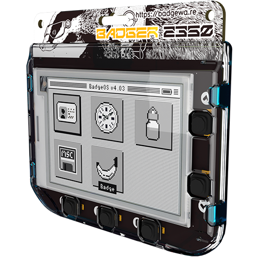
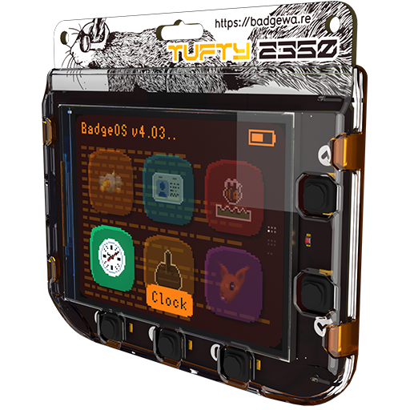
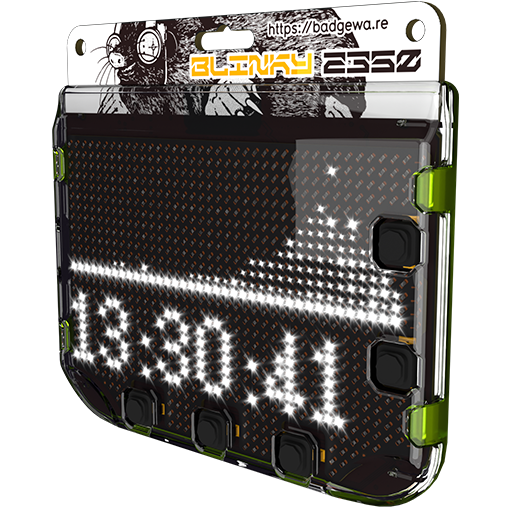

---
tags:
  - hardware
  - board
  - badgerware
  - tufty
  - blinky
  - badger
  - rp2350
---

# Badger Boards

## Badger Family

The Bagder board family consists of three smart interactive badges, each featuring a different display technology but sharing the same core hardware platform based on the Raspberry Pi RP2350 microcontroller. The badges are designed for wearable applications, with built-in rechargeable batteries, wireless connectivity, and a sturdy polycarbonate case.

| Badger                                 | Tufty                            | Blinky                                  |
| -------------------------------------- | -------------------------------- | --------------------------------------- |
|          |      |           |
| E-Paper display                        | Full-colour TFT LCD              | Mono LED matrix                         |
| 2.7" 264×176 greyscale e-paper display | 2.8" 320×240 full-colour IPS LCD | 3.6" 872 white mono LEDs (39×26 matrix) |

The base hardware platform includes:

| Feature    | Details                                                                                                                                                                                                                                                          |
| ---------- | ---------------------------------------------------------------------------------------------------------------------------------------------------------------------------------------------------------------------------------------------------------------- |
| Processor  | **Raspberry Pi RP2350** microcontroller (dual Arm Cortex M33 @ 250 MHz, 520 KB SRAM)                                                                                                                                                                             |
| Flash      | 16 MB QSPI flash (execute-in-place)                                                                                                                                                                                                                              |
| PSRAM      | 8 MB PSRAM                                                                                                                                                                                                                                                       |
| Wireless   | Raspberry Pi RM2 wireless module ([CYW43439](https://www.infineon.com/part/CYW43439)) for WiFi and Bluetooth connectivity                                                                                                                                        |
| Battery    | 1000 mAh rechargeable LiPo battery   [MCP73831](docs/badger/MCP73831_MCP73832_datasheet.pdf) charger IC for 455mA USB-C charging   [XB6096I2S](docs/badger/XY1410_18V_2A_DC_Converter.pdf) battery protector for over-charge and over-discharge protection |
| RTC        | [PCF85063A](docs/badger/PCF85063A_RTC_Calendar.pdf) real-time clock (wake-from-sleep capable)                                                                                                                                                                    |
| Buttons    | 5 front user buttons   Reset/Sleep button   Home/Boot button                                                                                                                                                                                               |
| Connectors | USB-C for charging and programming   I2C connector for connecting external breakouts such as [Qwiic/STEMMA QT](accessories.md)                                                                                                                                |
| Dimensions | 84 mm (W) × 76 mm (H) × 20 mm (D) with case                                                                                                                                                                                                                      |

### Processor & Memory

At the heart of the Badger 2350 is the **Raspberry Pi RP2350A**, a powerful dual-core microcontroller.

- **CPU:** Dual Arm Cortex-M33 cores running at up to 250 MHz
- **SRAM:** 520 KB on-chip
- **Flash:** 16 MB QSPI with execute-in-place (XiP)
- **PSRAM:** 8 MB — plenty of room for images, fonts, and data buffers

### Wireless Connectivity

The badge includes a **Raspberry Pi RM2 wireless module** based on the Infineon CYW43439 chipset:

- **Wi-Fi:** IEEE 802.11 b/g/n (2.4 GHz)
- **Bluetooth:** 5.0 (BLE supported)

This enables over-the-air updates, fetching live data from APIs, MQTT messaging, and more.

### Power & Battery

The built-in rechargeable lithium polymer battery keeps the Badger running for extended periods, especially when leveraging deep sleep modes.

| Component      | Specification                                                                                            |
| :------------- | :------------------------------------------------------------------------------------------------------- |
| **Battery**    | 1000 mAh LiPo                                                                                            |
| **Charger IC** | [MCP73831](docs/badger/MCP73831_MCP73832_datasheet.pdf) (455 mA charging current) |
| **Protector**  | XB6096I2S (over-charge / over-discharge protection)                                                      |
| **Charging**   | Via USB-C                                                                                                |

> **Tip:** Use the [PCF85063A](docs/badger/PCF85063A_RTC_Calendar.pdf) real-time clock to schedule wake-ups from deep sleep, keeping power consumption to an absolute minimum between display updates.

### Real-Time Clock (RTC)

- **IC:** [PCF85063A](docs/badger/PCF85063A_RTC_Calendar.pdf)
- **Function:** Maintains accurate time while the main processor is in deep sleep
- **Wake-up:** Can trigger the RP2350 to wake at a scheduled time for periodic updates (e.g., refresh a weather display every 15 minutes)

### Buttons

The Badger 2350 provides a total of **seven physical buttons**:

| Button    | Location | Function                                                          |
| :-------- | :------- | :---------------------------------------------------------------- |
| **A – E** | Front    | Five programmable user buttons                                    |
| **Reset** | Edge     | Reset the processor / enter sleep mode                            |
| **Home**  | Edge     | Return to the home screen / enter boot mode for flashing firmware |

### Connectors

| Connector                 | Purpose                                             |
| :------------------------ | :-------------------------------------------------- |
| **USB-C**                 | Charging the battery and programming via USB serial |
| **I2C Qwiic / STEMMA QT** | Plug-and-play connection for I2C breakout boards    |
| **SWD**                   | Serial Wire Debug for advanced debugging            |

## Badger 2350

{.center width="60.0%"}

The Badger 2350 uses a 2.7-inch electronic paper (E-Paper / E-Ink) display capable of rendering **four levels of greyscale**. E-Paper is reflective, meaning it looks great in direct sunlight and consumes zero power to maintain an image on screen.

- **Resolution:** 264 × 176 pixels
- **Greyscale levels:** 4 (black, dark grey, light grey, white)
- **Technology:** Electronic paper (bistable — holds image with no power)

Perfect for low-power information displays, pixel art, and slow-paced games. Programmable with **MicroPython** — no soldering required.

## Tufty 2350

{.center width="60.0%"}

The **Tufty 2350** is a smart, interactive badge featuring a vibrant **2.8" full-colour TFT IPS LCD display**.

- **Type:** 2.8" full-colour TFT IPS LCD
- **Resolution:** 320 × 240 pixels
- **Backlight:** Adjustable brightness
- **Light sensor:** On-board phototransistor for ambient light sensing (useful for auto-brightness or light-reactive apps)

Perfect for mini dashboards, fast-paced games, and eye-catching widgets — programmable with **MicroPython** and no soldering required.

## Blinky 2350

{.center width="60.0%"}

The **Blinky 2350** is a smart interactive badge featuring a bright white LED matrix display.s

- **Type:** White mono LED matrix with individually adjustable brightness
- **LED count:** 872 LEDs arranged in a **39 × 26** matrix, minus 'islands'
- **LED drivers:** FM6047 constant current LED drivers
- **Case lighting:** 4-zone mono LED backlighting around the case edge

Perfect for pixel art, animations, and simple games.
