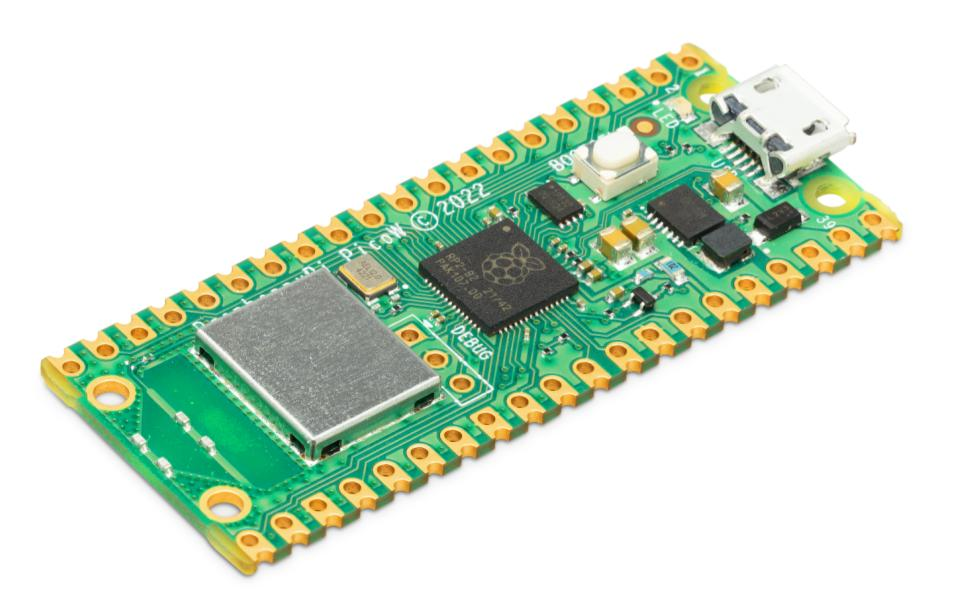
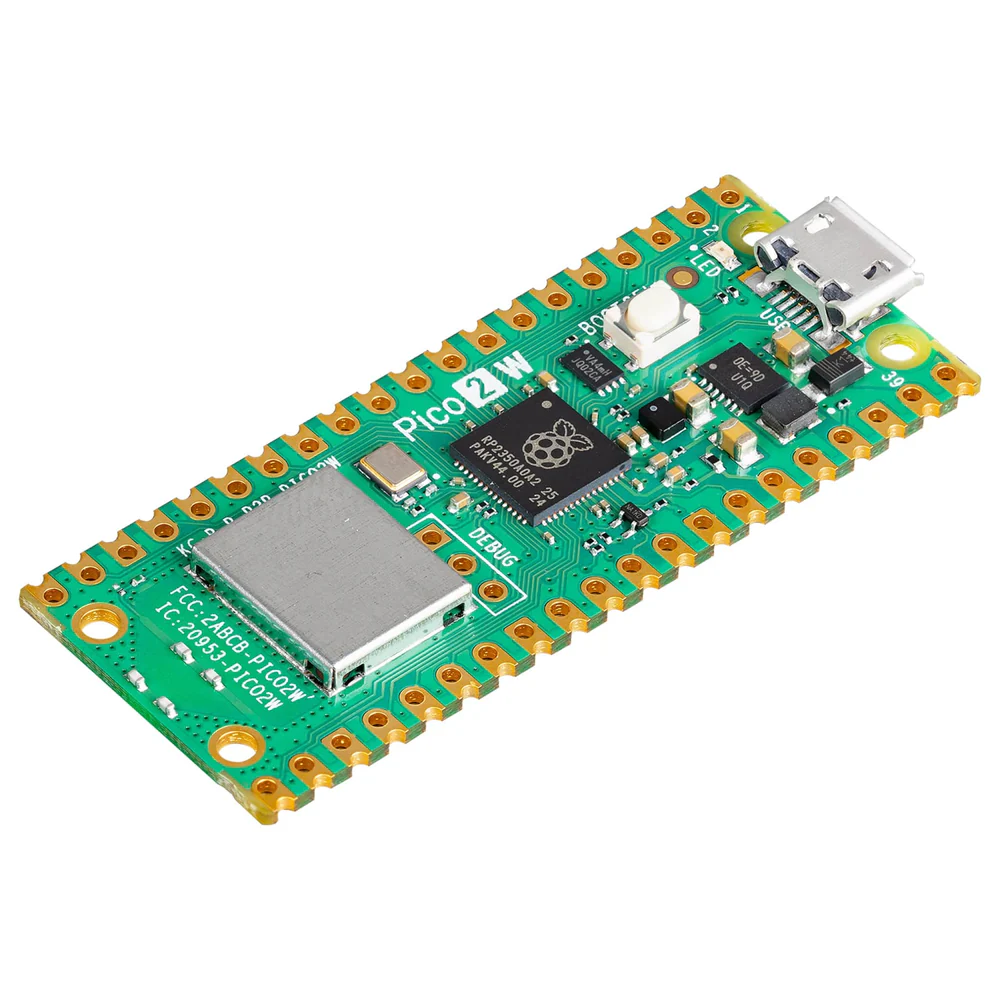

---
tags:
- hardware
- board
- raspberry pi
---
# Rpi Boards
{.center width="20.0%"}

For more detailes about the raspberrypi products see
[here](https://www.raspberrypi.org/products/).

## Model B
### Rpi 4B

{.center width="70.0%"}

- Broadcom BCM2711, Quad core Cortex-A72 (ARM v8) 64-bit SoC @ 1.5GHz
- 2GB, 4GB or 8GB LPDDR4-3200 SDRAM (depending on model)
- 2.4 GHz and 5.0 GHz IEEE 802.11ac wireless, Bluetooth 5.0, BLE
- Gigabit Ethernet
- 2 USB 3.0 ports; 2 USB 2.0 ports.
- Raspberry Pi standard 40 pin GPIO header (fully backwards compatible with previous boards)
- 2 × micro-HDMI ports (up to 4kp60 supported)
- 2-lane MIPI DSI display port
- 2-lane MIPI CSI camera port
- 4-pole stereo audio and composite video port
- H.265 (4kp60 decode), H264 (1080p60 decode, 1080p30 encode)
- OpenGL ES 3.0 graphics
- Micro-SD card slot for loading operating system and data storage
- 5V DC via USB-C connector (minimum 3A\*)
- 5V DC via GPIO header (minimum 3A\*)
- Power over Ethernet (PoE) enabled (requires separate PoE HAT)
- Operating temperature: 0 -- 50 degrees C ambient

!!! tip
    A good quality 2.5A power supply can be used if downstream USB peripherals consume less than 500mA in total.

### Rpi 3B+
The final revision of our third-generation single-board computer

1.4GHz 64-bit quad-core processor, dual-band wireless LAN, Bluetooth 4.2/BLE, faster Ethernet, and Power-over-Ethernet support (with separate PoE HAT)

{.center width="70.0%"}

The Raspberry Pi 3 Model B+ is the final revision in the Raspberry Pi 3 range.

- Broadcom BCM2837B0, Cortex-A53 (ARMv8) 64-bit SoC @ 1.4GHz
- 1GB LPDDR2 SDRAM
- 2.4GHz and 5GHz IEEE 802.11.b/g/n/ac wireless LAN, Bluetooth 4.2, BLE
- Gigabit Ethernet over USB 2.0 (maximum throughput 300 Mbps)
- Extended 40-pin GPIO header
- Full-size HDMI
- 4 USB 2.0 ports
- CSI camera port for connecting a Raspberry Pi camera
- DSI display port for connecting a Raspberry Pi touchscreen display
- 4-pole stereo output and composite video port
- Micro SD port for loading your operating system and storing data
- 5V/2.5A DC power input
- Power-over-Ethernet (PoE) support (requires separate PoE HAT)

### Rpi 2B
The Raspberry Pi 2 Model B is the second-generation Raspberry Pi. It replaced the original Raspberry Pi 1 Model B+ in February 2015.

{.center width="70.0%"}

- A 900MHz quad-core ARM Cortex-A7 CPU
- 1GB RAM
- 100 Base Ethernet
- 4 USB ports
- 40 GPIO pins
- Full HDMI port
- Combined 3.5mm audio jack and composite video
- Camera interface (CSI)
- Display interface (DSI)
- Micro SD card slot
- VideoCore IV 3D graphics core

### Rpi 1B+

The Model B+ is the final revision of the original Raspberry Pi. It replaced the Model B in July 2014 and was superseded by the Raspberry Pi 2 Model B

{.center width="70.0%"}

Compared to the Model B it has:

- More GPIO pins. The GPIO header has grown to 40 pins, while retaining the same pinout for the first 26 pins as the Model A and B.
- More USB ports. It comes with 4 USB 2.0 ports, compared to 2 on the Model B, and better hotplug and overcurrent behaviour.
- Micro SD. The old friction-fit SD card socket has been replaced with a much nicer push-push micro SD version.
- 100 Base Ethernet (same as the original Model B)
- Lower power consumption. By replacing linear regulators with switching ones we've reduced power consumption by between 0.5W and 1W.
- Better audio. The audio circuit incorporates a dedicated low-noise power supply.
- Neater form factor. We've aligned the USB connectors with the board edge, moved composite video onto the 3.5mm jack, and added four squarely-placed mounting holes.

## Model A
### Rpi 3A+
1.4GHz 64-bit quad-core processor, dual-band wireless LAN, Bluetooth 4.2/BLE in the same mechanical format as the Raspberry Pi 1 Model A+

{.center width="70.0%"}

The Raspberry Pi 3 Model A+ extends the Raspberry Pi 3 range into the A+ board format.

- Broadcom BCM2837B0, Cortex-A53 (ARMv8) 64-bit SoC @ 1.4GHz
- 512MB LPDDR2 SDRAM
- 2.4GHz and 5GHz IEEE 802.11.b/g/n/ac wireless LAN, Bluetooth 4.2/BLE
- Extended 40-pin GPIO header
- Full-size HDMI
- Single USB 2.0 ports
- CSI camera port for connecting a Raspberry Pi Camera Module
- DSI display port for connecting a Raspberry Pi Touch Display
- 4-pole stereo output and composite video port
- Micro SD port for loading your operating system and storing data
- 5V/2.5A DC power input

### Rpi 1A+
The Model A+ is the low-cost variant of the Raspberry Pi. It replaced the original Model A in November 2014.

{.center width="70.0%"}

Compared to the Model A it has:

- More GPIO pins. The GPIO header has grown to 40 pins, while retaining the same pinout for the first 26 pins as the Model A and B.
- Micro SD. The old friction-fit SD card socket has been replaced with a much nicer push-push micro SD version.
- Lower power consumption. By replacing linear regulators with switching ones we've reduced power consumption by between 0.5W and 1W.
- Better audio. The audio circuit incorporates a dedicated low-noise power supply.
- Smaller neater form factor. We've aligned the USB connector with the board edge, moved composite video onto the 3.5mm jack, and added four squarely-placed mounting holes. Model A+ is approximately 2cm shorter than the Model A.

## Compute Module
### Rpi CM3+
The Compute Module 3+ (CM3+) is a Raspberry Pi 3 Model B+ in a flexible form factor, intended for industrial applications

{.center width="70.0%"}

The CM3+ Compute Module contains the guts of a Raspberry Pi 3 Model B+ (the BCM2837 processor and 1GB RAM) as well as an optional eMMC Flash device of 8GB, 16GB or 32GB (which is the equivalent of the SD card in the Pi).

- Broadcom BCM2837B0, Cortex-A53 (ARMv8) 64-bit SoC @ 1.2GHz
- 1GB LPDDR2 SDRAM
- 8GB/16GB/32GB eMMC Flash memory, or a Lite variant without eMMC Flash memory

This is all integrated onto a small (67.6mm × 31mm) board that fits into a standard DDR2 SODIMM connector. The Flash memory is connected directly to the processor on the board, but the remaining processor interfaces are available to the user via the connector pins. You get the full flexibility of the BCM2837 SoC (which means that many more GPIOs and interfaces are available than with a standard Raspberry Pi), and designing the Module into a custom system should be relatively straightforward because we've put all the tricky bits onto the Module itself.

To help you get started designing a PCB to use the Module, we provide an open-source breakout board, which is supplied with both a 32GB and Lite version of the CM3+ in an affordable development kit.

### Rpi CM3 IOBoard
The Compute Module IO Board V3 is a development kit for those who wish to make use of the Raspberry Pi in a more flexible form factor

{.center width="70.0%"}

The Compute Module IO Board V3 is a development kit for those who wish to make use of the Raspberry Pi in a more flexible form factor, intended for industrial applications. The IO Board V3 is made for developing with CM3 and CM1.

## Model Zero
### Rpi Zero W
The Raspberry Pi Zero W extends the Pi Zero family and comes with added wireless LAN and Bluetooth connectivity.

{.center width="70.0%"}

The Raspberry Pi Zero W extends the Pi Zero family. Launched at the end of February 2017, the Pi Zero W has all the functionality of the original Pi Zero, but comes with added connectivity, consisting of:

- 802.11 b/g/n wireless LAN
- Bluetooth 4.1
- Bluetooth Low Energy (BLE)

Like the Pi Zero, it also has:

- 1GHz, single-core CPU
- 512MB RAM
- Mini HDMI and USB On-The-Go ports
- Micro USB power
- HAT-compatible 40-pin header
- Composite video and reset headers
- CSI camera connector

## Raspberry Pi Pico Series

The **Raspberry Pi Pico** series is a family of microcontroller boards developed by the Raspberry Pi Foundation. Unlike the full-size Raspberry Pi computers, which are capable of running Linux-based operating systems, the Pico boards are designed for embedded systems and bare-metal programming. They are ideal for low-power, real-time applications such as robotics, IoT devices, and sensor networks.

{width=49%}{width=49%}

More information about using the [Raspberry Pi Pico series](./pico.md).

### Overview

The Pico boards are based on the **RP2040** or **RP2350** microcontrollers—both custom chips designed by the Raspberry Pi Foundation. These boards are highly affordable, compact, and versatile, making them a popular choice among hobbyists, educators, and professionals.

Compared to other Raspberry Pi models (such as the Pi 4 or Pi Zero), the Pico boards do not support Linux or other conventional operating systems. Instead, they are typically programmed using C/C++ or MicroPython, and they interface directly with hardware through GPIO, SPI, I²C, UART, ADCs, and PWM outputs.

### Variants

Several variants of the Raspberry Pi Pico exist, including:

- **Pico** – Base model with no Wi-Fi and no pre-soldered headers.
- **Pico H** – Includes pre-soldered headers.
- **Pico W** – Includes onboard Wi-Fi (IEEE 802.11n) for wireless communication.
- **Pico WH** – Includes both onboard Wi-Fi and pre-soldered headers.

These variants allow users to choose the configuration that best fits their project needs—whether for compact integration, breadboard prototyping, or wireless networking.

### Microcontroller Versions

#### RP2040

The **RP2040** is the original microcontroller used in the first generation of Raspberry Pi Pico boards. Its key specifications include:

- **Dual-core Arm Cortex-M0+ processor** running at up to 133 MHz
- **264 KB SRAM**
- **2 MB Flash memory (external)**
- **30 GPIO pins**, including:
    - 2 × SPI
    - 2 × I²C
    - 2 × UART
    - 3 × 12-bit ADC channels
    - 16 × PWM channels
- **USB 1.1 host/device support**
- **Low-power sleep and dormant modes**
- **Programmable I/O (PIO) blocks** for custom peripheral support

#### RP2350

The **RP2350** is a more advanced microcontroller introduced with the Raspberry Pi Pico 2 board. It features a **heterogeneous dual-core architecture**, allowing for flexible configurations:

- **Dual-core Arm Cortex-M33 processors**
- **Dual-core Hazard3 RISC-V processors**
- **Mixed-core configuration**: one Arm Cortex-M33 and one Hazard3 RISC-V

Only two cores can be active at a time, and the selection depends on the specific application requirements.

##### Arm Cortex-M33 Cores

- **Architecture**: ARMv8-M Mainline
- **Clock Speed**: Up to 150 MHz
- **Features**:
    - TrustZone security technology
    - Optional single-precision Floating-Point Unit (FPU)
    - DSP instructions for efficient signal processing
    - Hardware divide and multiply instructions
    - Memory Protection Unit (MPU) support
    - Secure boot and cryptographic acceleration

##### Hazard3 RISC-V Cores

- **Architecture**: RV32IMAC+ (32-bit RISC-V)
- **Clock Speed**: Up to 150 MHz
- **Features**:
    - 3-stage in-order pipeline
    - Support for standard RISC-V extensions:
        - Integer multiplication and division (M)
        - Atomic instructions (A)
        - Compressed instructions (C)
    - Additional extensions: Zba, Zbb, Zbs, Zbkb, Zcb, Zcmp, Zicsr
    - Designed for low-power and efficient embedded applications

##### RP2350 Specifications

- **Memory**:
    - 520 KB SRAM (10 banks)
    - 8 KB One-Time Programmable (OTP) memory
    - Support for up to 16 MB external QSPI flash or PSRAM
- **Peripherals**:
    - 3 × Programmable I/O (PIO) blocks (12 state machines)
    - 24 × PWM channels
    - 4 or 8 × 12-bit ADC channels (depending on package)
    - 2 × UART
    - 2 × SPI
    - 2 × I²C
    - 1 × USB 1.1 host/device controller
    - 1 × High-Speed Transmit (HSTX) for digital video output
- **Power Management**:
    - On-chip switched-mode power supply (SMPS)
    - Programmable low-dropout regulator (LDO)
- **Security**:
    - Secure boot with protected OTP storage
    - Hardware SHA-256 accelerator
    - True Random Number Generator (TRNG)
