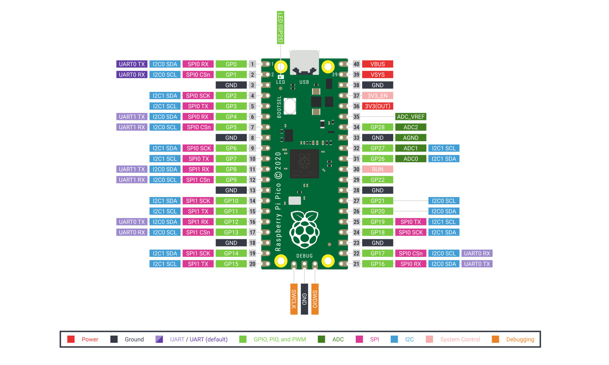

---
tags:

- hardware
- board
- raspberry pi

---

# Raspberry Pi Pico



[RP2040 Datasheet](docs/RP2040 Datasheet.pdf)
[RP2350 Datasheet](docs/RP2350 Datasheet.pdf)


## Debug Probe
How to install, setup and use the [debug probe](https://www.raspberrypi.com/documentation/microcontrollers/debug-probe.html).
{.center width}

### Wiring
The debug probe contains two cables. The gray for programming and debug and the black, red, yellow for a Serial UART Communcation.


### Installation

We will use probe-rs

```bash
# install gdb
brew install arm-none-eabi-gdb

# probe-rs
brew tap probe-rs/probe-rs
brew install probe-rs
```

### Programming
The Pico Debug Probe will let you load binaries via the SWD port and OpenOCD: you will not need to unplug, and then push-and-hold, the BOOTSEL button every time you push a new binary to your Pico. Using the Debug Probe uploading new binaries is an entirely hands off affair.

```bash
sudo openocd -f interface/cmsis-dap.cfg -f target/rp2040.cfg -c "adapter speed 5000" -c "program blink.elf verify reset exit"
```


