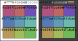

---
tags:
- multimedia
- picture
- color
- palette
---

# Color Palette

{width:"500px"}

## Dark
| Color          | Hex       | RGB                  | Example |
|----------------|-----------|----------------------|---------|
| bg             | `#404040` | `rgb(64, 64, 64)`    | 

 |
| text           | `#ffffff` | `rgb(255, 255, 255)` | 

 |
| text-secondary | `#d0d0d0` | `rgb(208, 208, 208)` | 

 |
| text-tertiary  | `#808080` | `rgb(128, 128, 128)` | 

 |
| primary        | `#af547f` | `rgb(175, 84, 127)`  | 

 |
| secondary      | `#577ab7` | `rgb(87, 122, 183)`  | 

 |
| tertiary       | `#b69858` | `rgb(182, 152, 88)`  | 

 |
| quaternary     | `#bb6967` | `rgb(187, 105, 103)` | 

 |
| quinary        | `#629cb9` | `rgb(98, 156, 185)`  | 

 |
| senary         | `#a1bb5d` | `rgb(161, 187, 93)`  | 

 |
| septenary      | `#704fb6` | `rgb(112, 79, 182)`  | 

 |
| octonary       | `#6cbaaf` | `rgb(108, 186, 175)` | 

 |
| nonary         | `#71ba5b` | `rgb(113, 186, 91)`  | 

 |

## Light
| Color          | Hex       | RGB                  | Example |
|----------------|-----------|----------------------|---------|
| bg             | `#ffffff` | `rgb(255, 255, 255)` | 

 |
| text           | `#000000` | `rgb(0, 0, 0)`       | 

 |
| text-secondary | `#404040` | `rgb(64, 64, 64)`    | 

 |
| text-tertiary  | `#808080` | `rgb(128, 128, 128)` | 

 |
| primary        | `#af547f` | `rgb(175, 84, 127)`  | 

 |
| secondary      | `#577ab7` | `rgb(87, 122, 183)`  | 

 |
| tertiary       | `#b69858` | `rgb(182, 152, 88)`  | 

 |
| quaternary     | `#bb6967` | `rgb(187, 105, 103)` | 

 |
| quinary        | `#629cb9` | `rgb(98, 156, 185)`  | 

 |
| senary         | `#a1bb5d` | `rgb(161, 187, 93)`  | 

 |
| septenary      | `#704fb6` | `rgb(112, 79, 182)`  | 

 |
| octonary       | `#6cbaaf` | `rgb(108, 186, 175)` | 

 |
| nonary         | `#71ba5b` | `rgb(113, 186, 91)`  | 

 |
