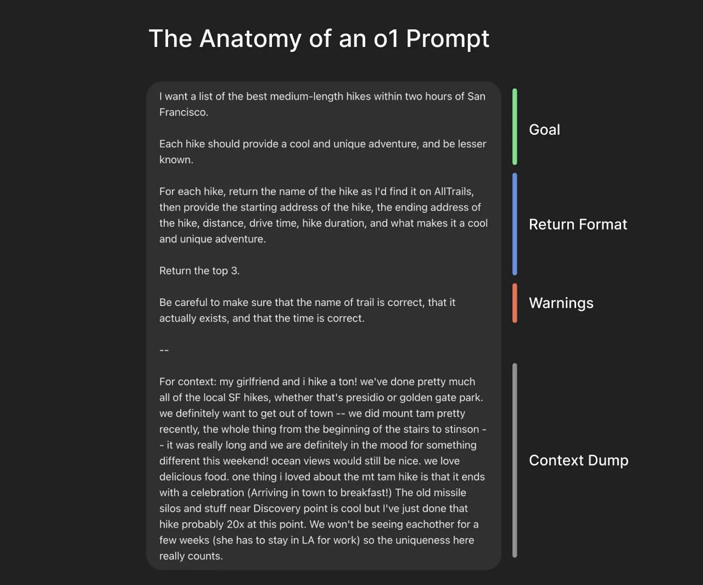

---
tags:
- multimedia
- writing
- llm
- chatgpt
- prompt engineering
- reasoning prompt
---

## Reasoning Prompt

Credit to  for the Reasoning Prompt framework.




[Greg Brockmann's](https://x.com/gdb/status/1878489681702310392) **Reasoning Prompt** is a structured way to design prompts that maximize clarity, accuracy, and context awareness in AI-generated responses. The prompt is broken down into four key components:

1. **Goal** – Clearly define what you want to achieve.
2. **Return Format** – Specify how the response should be structured.
3. **Warnings** – Highlight important constraints or accuracy checks.
4. **Context Dump** – Provide additional background to refine the response.

## Example Prompt Breakdown

```md
I want a list of the best medium-length hikes within two hours of San Francisco.

Each hike should provide a cool and unique adventure and be lesser known.

For each hike, return the name of the hike as I'd find it on AllTrails, then provide:
- The starting address of the hike
- The ending address of the hike
- Distance
- Drive time
- Hike duration
- What makes it a cool and unique adventure.

Return the top 3.

Be careful to make sure that the name of the trail is correct, that it actually exists, and that the time is correct.

--

For context: My girlfriend and I hike a ton! We've done pretty much all of the local SF hikes, whether that's Presidio or Golden Gate Park. We definitely want to get out of town -- we did Mount Tam pretty recently, the whole thing from the beginning of the stairs to Stinson – it was really long, and we are definitely in the mood for something different this weekend! Ocean views would still be nice. We love delicious food. One thing I loved about the Mount Tam hike is that it ends with a celebration (arriving in town for breakfast!). The old missile silos and stuff near Discovery Point are cool, but I've just done that hike probably 20 times at this point. We won't be seeing each other for a few weeks (she has to stay in LA for work), so the uniqueness here really counts.4
```

## Key Components

### Goal

The user clearly states their goal:
“I want a list of the best medium-length hikes within two hours of San Francisco.”
This ensures the AI understands the primary request before proceeding.

### Return Format

The user defines the expected structure, ensuring a consistent and useful response:

- Name of the hike (as listed on AllTrails)
- Starting and ending addresses
- Distance, drive time, and hike duration
- A reason why the hike is unique

### Warnings

The prompt includes accuracy checks to improve response quality:
“Be careful to make sure that the name of the trail is correct, that it actually exists, and that the time is correct.”

### Context Dump

The user provides additional background to refine the response:
```md
For context: My girlfriend and I hike a ton! We've done pretty much all of the local SF hikes, whether that's Presidio or Golden Gate Park. We definitely want to get out of town -- we did Mount Tam pretty recently, the whole thing from the beginning of the stairs to Stinson – it was really long, and we are definitely in the mood for something different this weekend! Ocean views would still be nice. We love delicious food. One thing I loved about the Mount Tam hike is that it ends with a celebration (arriving in town for breakfast!). The old missile silos and stuff near Discovery Point are cool, but I've just done that hike probably 20 times at this point. We won't be seeing each other for a few weeks (she has to stay in LA for work), so the uniqueness here really counts.
```

## Why This Works

1. **Ensures Clarity** – The structure prevents ambiguity, making the request more actionable.
2. **Improves Accuracy** – The warnings ensure fact-checking is prioritized.
3. **Enhances Relevance** – The context dump personalizes the response, making it more meaningful.

## Examples

### Technical Documentation
```md
I need a well-structured technical guide explaining how to set up a Kubernetes cluster on AWS using EKS.

- Introduction to Kubernetes and AWS EKS.
- Step-by-step instructions for creating an EKS cluster.
- A section on best practices for security and cost optimization.
- A troubleshooting section for common setup issues.
- Markdown format.

Ensure that all instructions are up to date with the latest AWS CLI and Kubernetes versions. Avoid deprecated commands.

This guide is meant for DevOps engineers with basic knowledge of Kubernetes but new to AWS EKS. The company primarily works with Terraform for infrastructure as code, so integrating Terraform steps would be useful.
```

### Creative Writing
```md
Generate an engaging short story about an AI assistant that develops human emotions.

- A short story (~1000 words).
- Written in the first-person perspective from the AI’s point of view.
- A strong emotional arc leading to a philosophical conclusion.

Avoid clichés and ensure originality. The story should explore ethical dilemmas rather than just being a standard sci-fi adventure.

The story is for a speculative fiction anthology focusing on human-AI relationships. The target audience enjoys deep, thought-provoking narratives rather than action-heavy plots.
```

### Academic Research Summary
```md
Goal:
Summarize the key findings of the latest research on quantum computing advancements in 2024.

Return Format:
- A structured summary with key breakthroughs.
- Explanation of implications for industries like cryptography and AI.
- Include citations in APA format.

Warnings:
Ensure that the information is sourced from peer-reviewed research and avoid oversimplifying technical concepts.

Context Dump:
The summary is for an interdisciplinary research group consisting of physicists, software engineers, and business strategists. The explanation should balance technical depth with accessibility.
```

### Business Strategy Analysis
```md
Goal:
Analyze Tesla’s current market position and provide a SWOT (Strengths, Weaknesses, Opportunities, Threats) analysis.

Return Format:
- A concise summary of Tesla’s competitive landscape.
- A SWOT table in Markdown format.
- Three key strategic recommendations based on the analysis.

Warnings:
Ensure that sources are recent (2024 data preferred) and avoid speculative claims without evidence.

Context Dump:
This analysis is for an internal strategy meeting at an investment firm. The audience is well-versed in financial markets but not deeply technical about electric vehicle manufacturing.
```
