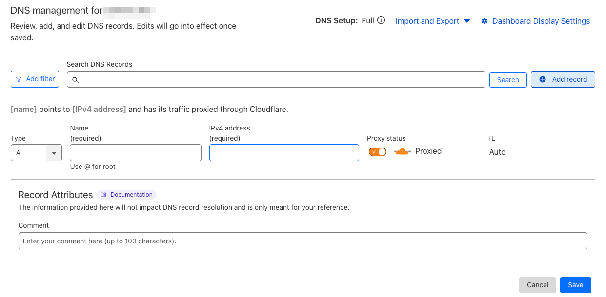

---
tags:
- tools
- cloudflare
- github
- pages
- custom domain
---

# Set a custom domain for GitHub Pages

If you want to have a custom domain for your GitHub Pages, you can follow the steps below.

It is possible to configure *one custom domain* for each GitHub Pages repository.

## Steps

1. Goto cloudflare and get a custom domain. In this tutorial, I will use `example.com`.
2. In the github repository goto `Settings` -> `Pages` -> `Custom domain` and set the custom domain.
    {.center}

    !!! note
        The custom domain can be the root domain (`example.com`) or a subdomain (`www.example.com` or `page.example.com`).
3. Add the required `A` and `AAAA` records to the DNS settings of the custom domain in Cloudflare. The IP addresses for IPv4 and IPv6 can be found in the [GitHub Docs](https://docs.github.com/en/pages/configuring-a-custom-domain-for-your-github-pages-site/managing-a-custom-domain-for-your-github-pages-site)
    {.center}
    - For a root domain (`example.com`), add the following records:
        - Four `A` record with the *Name* `@` and the *IP Addresses* `185.199.108.153` `185.199.109.153` `185.199.110.153` `185.199.111.153`
        - Four `AAAA` record with the *Name* `@` and the *IP Addresses* `2606:50c0:8000::153` `2606:50c0:8001::153` `2606:50c0:8002::153` `2606:50c0:8003::153`
    - For a subdomain (`page.example.com`), add the following records:
        - Four `A` record with the *Name* `page` and the *IP Addresses* `185.199.108.153` `185.199.109.153` `185.199.110.153` `185.199.111.153`
        - Four `AAAA` record with the *Name* `page` and the *IP Addresses* `2606:50c0:8000::153` `2606:50c0:8001::153` `2606:50c0:8002::153` `2606:50c0:8003::153`
     ```
        ;; A Records
        page.example.com.	1	IN	A	185.199.111.153 ; cf_tags=cf-proxied:true
        page.example.com.	1	IN	A	185.199.110.153 ; cf_tags=cf-proxied:true
        page.example.com.	1	IN	A	185.199.109.153 ; cf_tags=cf-proxied:true
        page.example.com.	1	IN	A	185.199.108.153 ; cf_tags=cf-proxied:true
        ;; AAAA Records
        page.example.com.	1	IN	AAAA	2606:50c0:8003::153 ; cf_tags=cf-proxied:true
        page.example.com.	1	IN	AAAA	2606:50c0:8002::153 ; cf_tags=cf-proxied:true
        page.example.com.	1	IN	AAAA	2606:50c0:8001::153 ; cf_tags=cf-proxied:true
        page.example.com.	1	IN	AAAA	2606:50c0:8000::153 ; cf_tags=cf-proxied:true
      ```
    {.center}
4. Wait a few minutes for the DNS records to propagate.
5. Done! Now you can access your GitHub Pages with your custom domain. `page.example.com`
