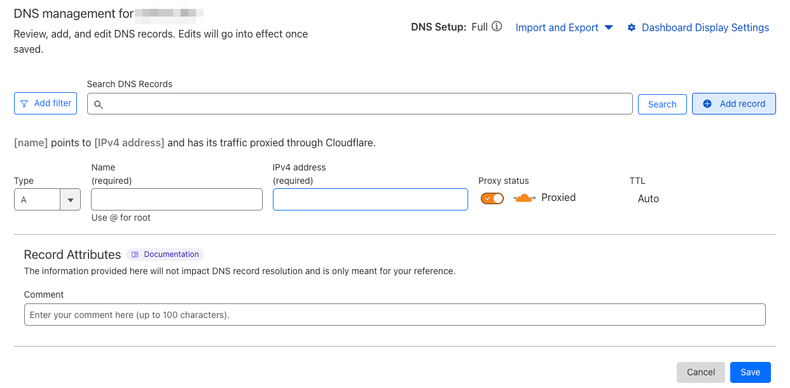
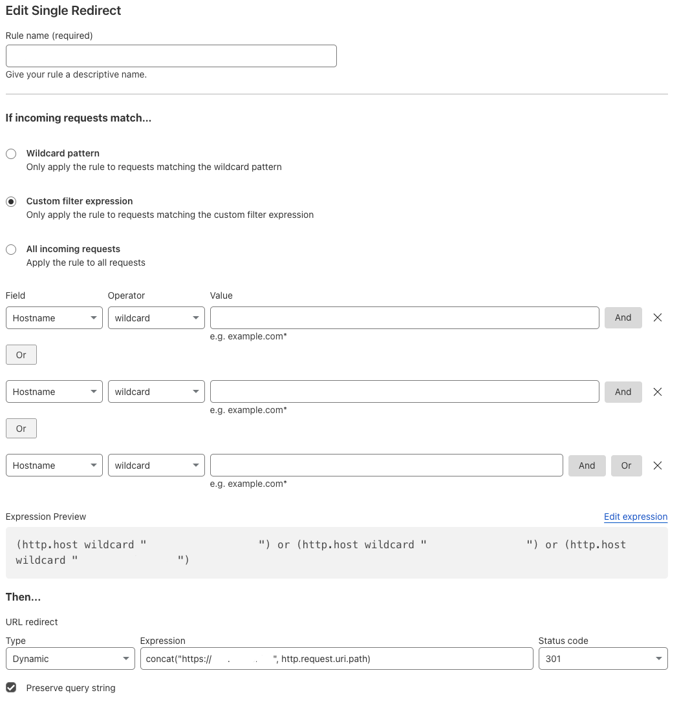

---
tags:
- tools
- cloudflare
- redirect subdomains
---

# Redirect subdomains to another subdomain

If you want multiple subdomains pointing to the same subdomain or root domain, you can use Cloudflare to redirect the subdomains.

The domain or subdomain needs to be the default and already be configured. For a github page see [Github Custom Domain](gh-pages.md) to realize this.

In thie example the main subdomain is `page.example.com` and new redirected subdomains are `pages.example.com` and `docs.example.com`.

## Steps

1. Within cloudflare add a DNS Record for each subdomain you want to redirect.
    In this example, we add two `A` records for `pages.example.com` and `docs.example.com` pointing to the cloudflare ip `192.0.2.1` this allows cloudflare to add custom rules.
    ```
    pages.example.com.	1	IN	A	192.0.2.1 ; cf_tags=cf-proxied:true
    docs.example.com.	1	IN	A	192.0.2.1 ; cf_tags=cf-proxied:true
    ```
    {.center}
2. In the cloudflare section for that domain goto `Rules` and add the following rule:
   - *Redirect Rules*
   - Custom filter expression
      - Field `Hostname` Operator `wildcard` Value `pages.example.com`
      - OR
      - Field `Hostname` Operator `wildcard` Value `docs.example.com`
   - Then
      - Type `Dynamic` Expression `concat("https://page.example.com", http.request.uri.path)` Status code `301`
      - Check Preserve query string
   {.center}
4. Wait a few minutes for the DNS records and rule to propagate.
5. Done! Now you can access your Webpage with your two new custom domain. `pages.example.com` and `docs.example.com`
