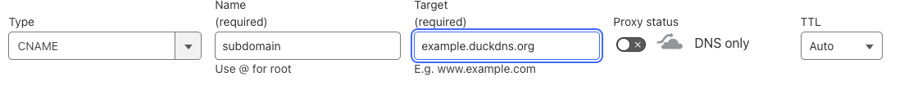
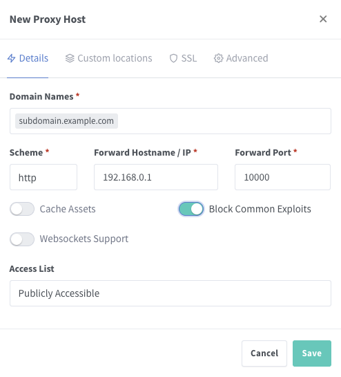
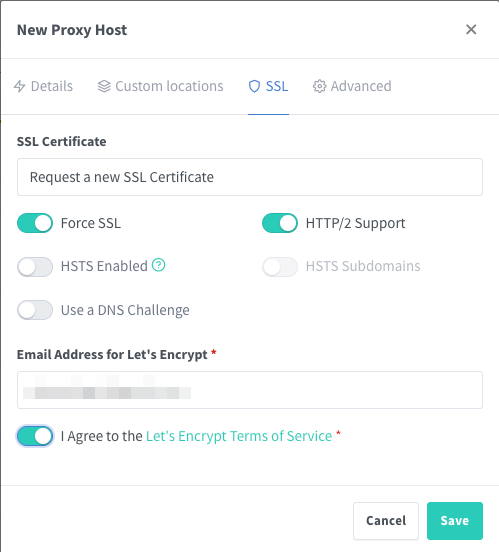
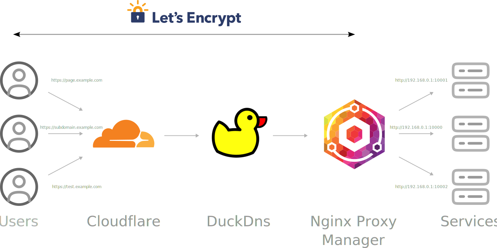

---
tags:
- tools
- cloudflare
- github
- pages
- custom domain
---

# Set a custom domain for GitHub Pages

If you want that your server services use your custom subdomain such as `subdomain.example.com`, you will use tool like:

](img/duckdns.png){.center width="150px"}

](img/nginx-proxy-manager.svg){.center width="130px"}

 for free ssl certificates](img/lets-encrypt.svg){.center  width="200px"}

{.center  width="200px"}

## Steps

1. First of all your home IP will change from time to time. Therefore you first need to to use a Dynamic DNS service such as [DuckDNS](https://www.duckdns.org/) is free, reliable and highly recomended.. You can create an account and get a subdomain such as `subdomain.duckdns.org`.
2. Dont forget to install and configure the DuckDNS client on your server. You can find the installation instructions on the [DuckDNS Docs](https://www.duckdns.org/install.jsp).
3. For each server service setup a DNS Record for your custom subdomain in Cloudflare to the `subdomain.duckdns.org` which resolved to your server's ip address
    - Type `CNAME`
    - Name `subdomain` (`subdomain.example.com`)
    - Target `subdomain.duckdns.org`
    - Proxy status `DNS only`
    - TTL `Auto`
    {.center}
4. You can use a reverse proxy such as [Nginx Proxy Manager](https://nginxproxymanager.com/) to manage your server services. After installing the Nginx Proxy Manager, you need to port forward the default ports for Nginx Proxy Manager in your Router:
    - `80` to `80`
    -  `443` to `443`
5. Within the Nginx Proxy Manager, you can create a proxy host from your new subdomain `subdomain.example,com` to your server service (IP and Port). In the example:
    - In the Details tab:
      - Domain Names `subdomain.example.com`
      - Scheme `http`
      - Forward Hostname/IP `192.168.0.1`
      - Forward Port `10000`
      - Block Common Exploits `Yes`
    - In the SSL tab:
      - SSL Certificate `Request a new SSL Certificate`
      - Force SSL `Yes`
      - HTTP/2 Support `Yes`

    {width="45%"}{width="45%"}
6. This will send the traffic from `subdomain.example.com` to your server service. The SSL certificate will be automatically generated by Let's Encrypt and renewed every 3 months.
4. Wait a few minutes for the DNS records to propagate.
5. Done! Now you can access your Server Services with your custom domains on `https://` such as `https://subdomain.example.com`.

{.center}
