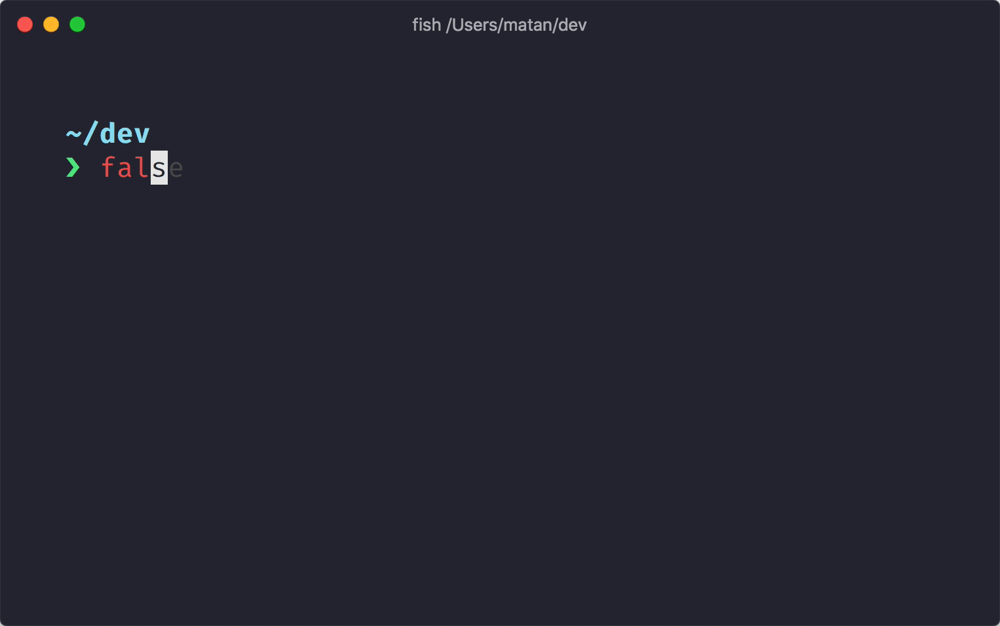

---
tags:
- tools
- starship
---
# StarShip

{.center width="40%"}

The minimal, blazing-fast, and infinitely customizable prompt for any shell!

{align="right" width="40%"}

- **Fast**: it's fast – really really fast! 🚀
- **Customizable**: configure every aspect of your prompt.
- **Universal**: works on any shell, on any operating system.
- **Intelligent**: shows relevant information at a glance.
- **Feature rich**: support for all your favorite tools.
- **Easy**: quick to install – start using it in minutes.

## Prerequisites

You need a [NerdFont](https://www.nerdfonts.com/) for example [FiraCode Nerd Font](https://www.nerdfonts.com/font-downloads) to display the icons.

## Installation

```bash
# Linux and MacOS
curl -fsSL https://starship.rs/install.sh | bash

# MacOS
brew install starship

# Windows
choco install starship
```

Setup in your shell configuration file:

```bash title="zsh.rc"
eval "$(starship init zsh)"
```

## Configuration
Create the config file:

```bash
mkdir -p ~/.config && touch ~/.config/starship.toml
```

Get some presets from here: [Starship Presets](https://starship.rs/presets/)

Apply the desired presets:
```bash
starship preset nerd-font-symbols > ~/.config/starship.toml
```
