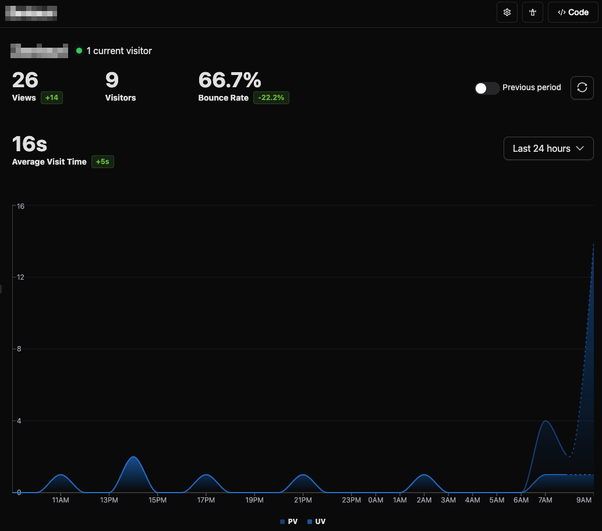
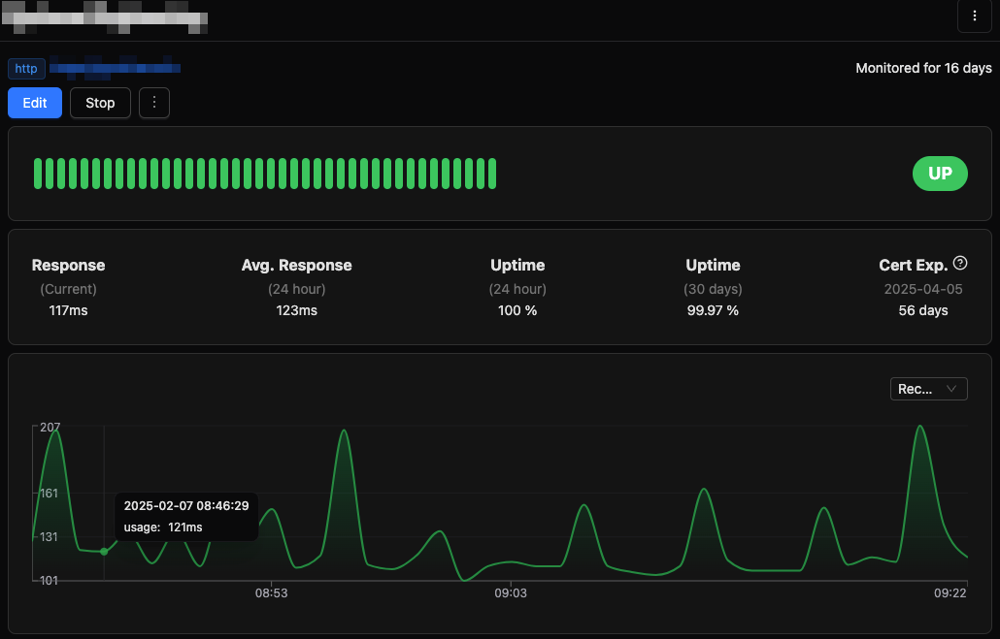
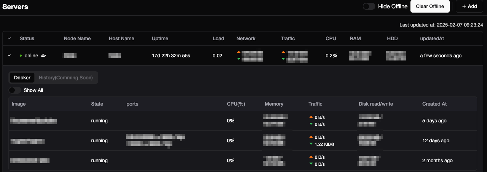
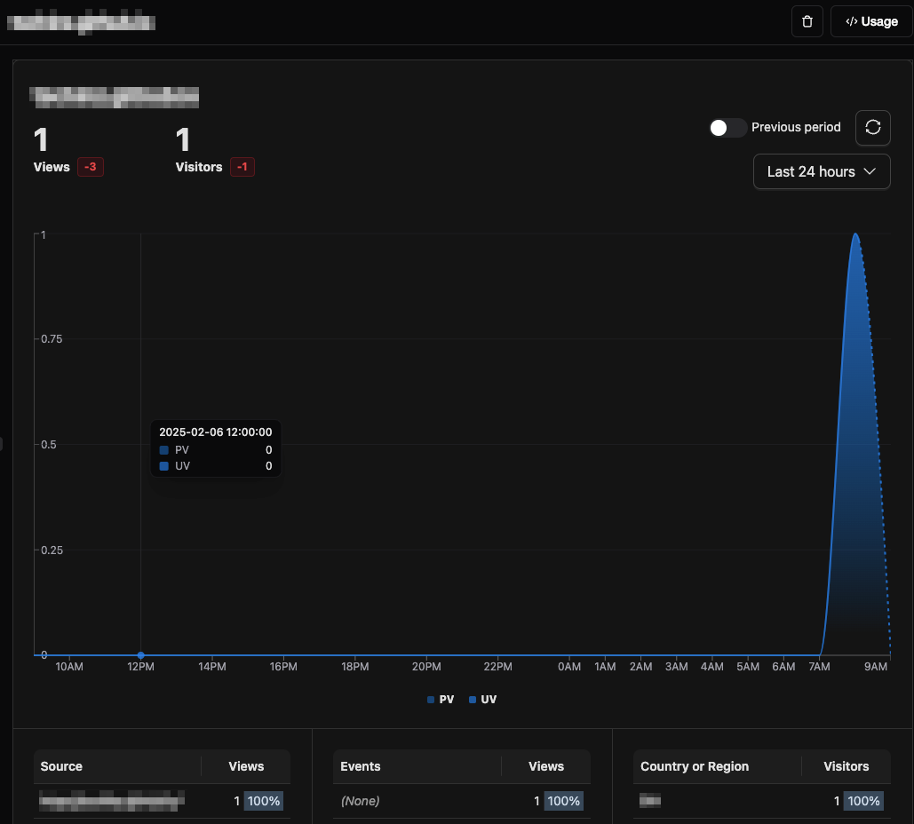

---
tags:
- tools
- tianji
---
#  Tianji

{.center width="20%"}

Tianji is an open-source platform that integrates website analytics, uptime monitoring, and server status tracking into a single, user-friendly interface. Designed to streamline the monitoring and analysis process, Tianji eliminates the need for multiple disparate tools, offering a comprehensive solution for developers and website administrators.

## Key Features

- **Website Analytics**: Gain insights into visitor behavior, page views, and user engagement metrics, similar to platforms like Google Analytics.
- **Uptime Monitoring**: Continuously monitor your website's availability and receive instant alerts in case of downtime or performance issues.
- **Server Status Tracking**: Keep track of your server's health and performance metrics to ensure optimal operation.
- **Telemetry**: Track visits of almost any page you create with an invisible image, allows to show a visitor badge.

## Setup

### Cloud Version

Create an account in the [official Tianji instance](https://app-tianji.msgbyte.com/). The free tier has some limitations, but other subscriptions are possible:

**Free** - _$0 per month_

- Basic trial
- Basic Usage
- Up to 3 websites
- Up to 3 surveys
- Up to 3 feed channels
- 100K website events per month
- 100K monitor execution per month
- 10K feed event per month
- Discord Community Support

### Local Version
You can also install and run tinaji via docker on your server or even locally.

Deploying Tianji is straightforward, especially with Docker. Follow these steps:

- Download the Docker Compose file:
   ```bash
   wget https://raw.githubusercontent.com/msgbyte/tianji/master/docker-compose.yml
   ```
- Start the Tianji Service
   ```bash
   docker compose up -d
   ```

The default login credentials are `admin` for both the username and password. It’s highly recommended to change the password upon first login to maintain security.

For more detailed information and updates, visit the [official Tianji](https://tianji.msgbyte.com/) website and the [GitHub repository](https://github.com/msgbyte/tianji).

## Usage

### Website Analytics
For most website it suffice to add the following in your website head script:

```html
<script async defer src="https://app-tianji.msgbyte.com/tracker.js" data-website-id="xxxxxxxxxxxxxxxxxxxxxxxxxx"></script>
```

#### For MKDocs

For MK Docs add the following html in your overrides folder

```html title="overrides/partials/integrations/analytics/tianji.html"
<script
  var
  property="async"
  defer
  src="https://app-tianji.msgbyte.com/tracker.js"
  data-website-id="{ { config.extra.analytics.website_id } }`"
></script>
```

In your `mkdocs.yml` you need to define the follwing:

```yml title="mkdocs.yml"
theme:
  custom_dir: docs/_extra/overrides
extra:
  analytics:
    provider: tianji
    website_id: xxxxxxxxxxxxxxxxxxxxxxxxx
```



### Monitor

The url monitor allows to check if a IP address or a URL is live and gather statistic. Monitor Types are:

- `ping`
- `tcp port`
- `dns`
- `http`
- `openai`
- `custom`



### Server

For the server monitor you need to install the `tianji-reporter` onto your server. This can be done automatically for many distributions via the commandline:

```bash
curl -o- https://app-tianji.msgbyte.com/serverStatus/xxxxxxxxxxxxxxxxxxxxxxxxx/install.sh?url=https://app-tianji.msgbyte.com | sudo bash
```

If your server distribution is not supported (for example for Unraid Slackware) you can install and run it yourself. Download the `tianji-reporter` copy in onto your server and let is start once the server starts.

```bash
./tianji-reporter --url https://app-tianji.msgbyte.com --workspace xxxxxxxxxxxxxxxxxxxxxxxxx
```



### Telemetry

Telemetry allows to observe the interactions people have with any of your content. As long as you can plase a image you can check the
Here is some way to use telemetry:

- if your article support raw html, you can direct insert it `https://app-tianji.msgbyte.com/telemetry/xxxxxxxxxxxxxxxxxxxxxxxxx/yyyyyyyyyyyyyyyyyyyyyyyy.gif
- to get the visitor count simply add the follwowing image https://app-tianji.msgbyte.com/telemetry/xxxxxxxxxxxxxxxxxxxxxxxxx/yyyyyyyyyyyyyyyyyyyyyyyy/badge.svg

For an example see the Zentauri main page 



### Notifications via Telegram

With the [`Botfather`](https://telegram.me/BotFather) you can create a bots:

```
/newbot
=> give a name
/setdescription
=> give a description
/setuserpic
=> asssign an image
/token
=> get the acces http api token
```

In the Tianji Settings => Notification seelct Telegram Nottifications and insert the Bot Token.
